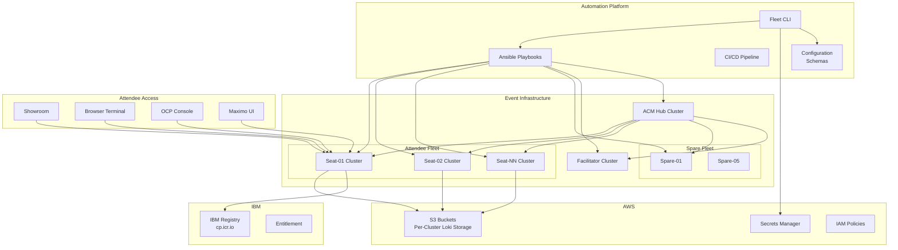
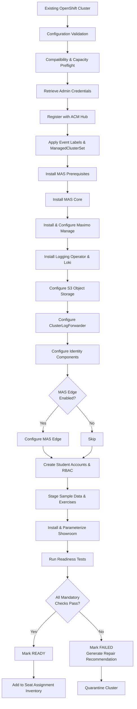
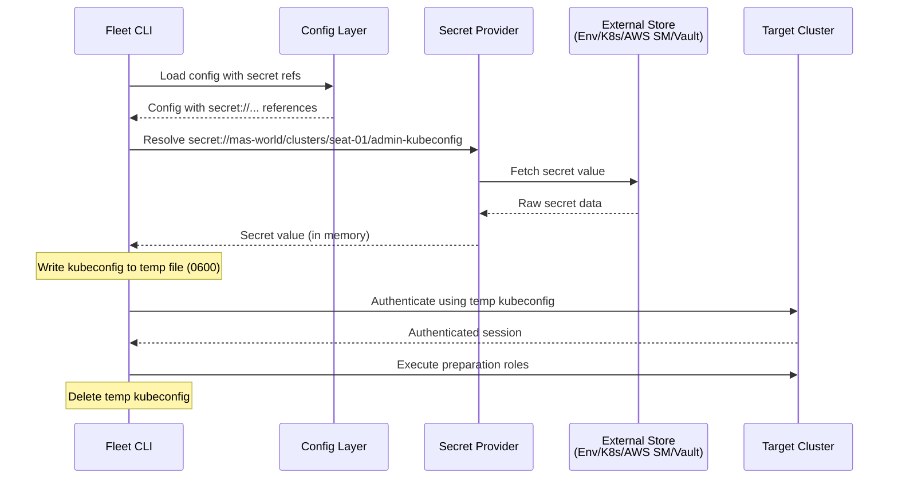
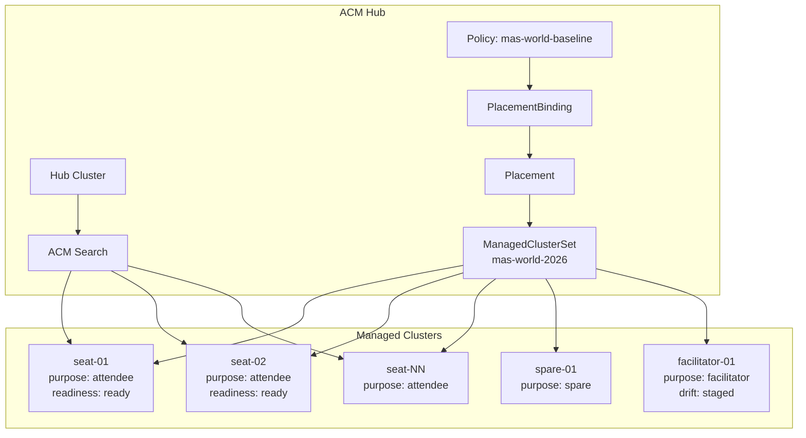
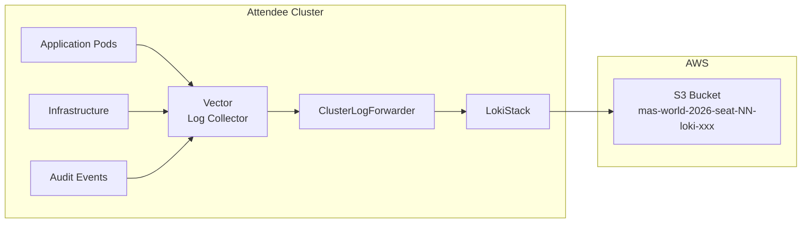
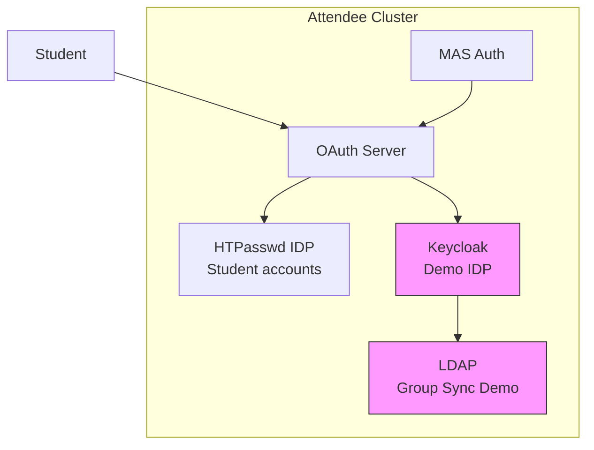
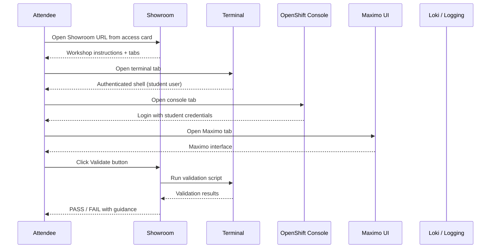
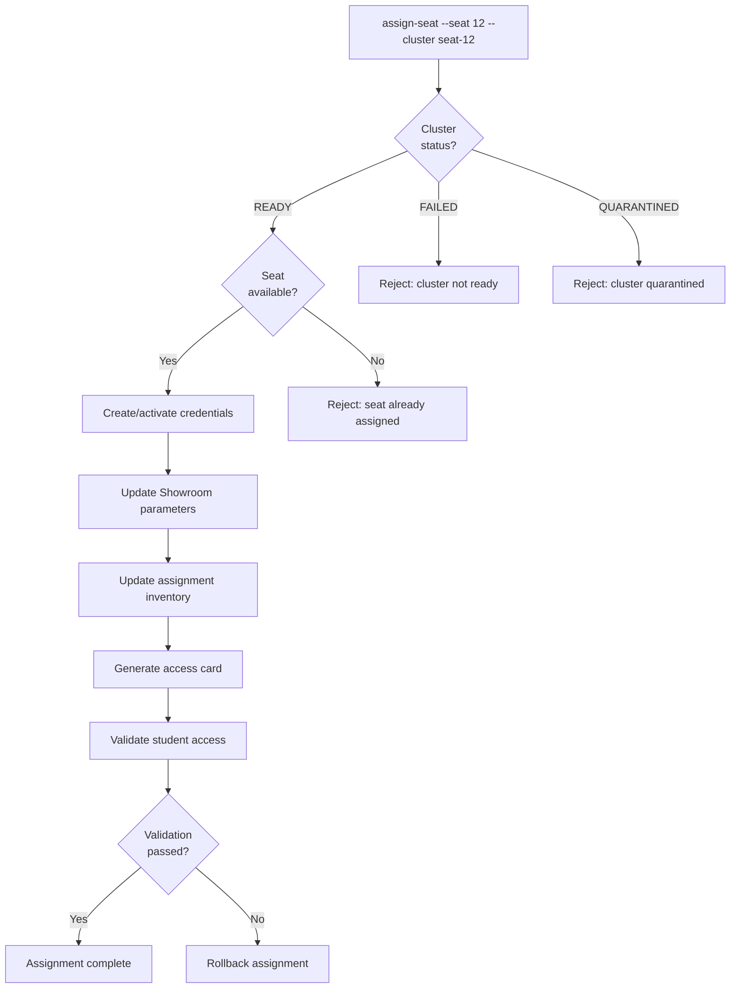
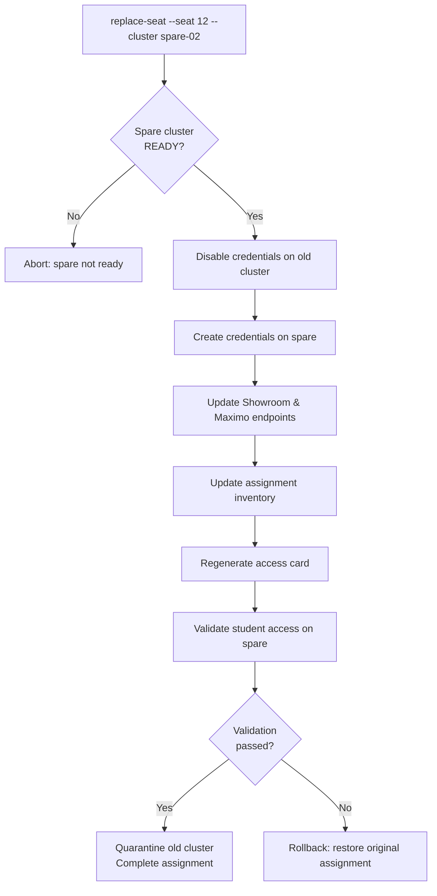
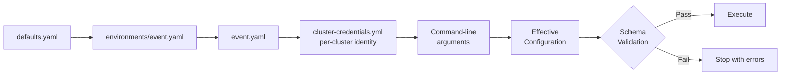

# Architecture

## Overview

This project runs entirely on `localhost` — all `rosa` and `aws` CLI commands execute locally, targeting remote AWS accounts via per-cluster environment variables.

## Data Flow

```
group_vars/all/cluster_topology.yml    secrets/cluster-credentials.yml    group_vars/all/infra_state.yml
         (categories, counts, sizing)   (per-cluster AWS keys, region,     (auto-discovered subnet_ids
                        \                optionally subnet_ids)              from setup-infra.yml)
                         \                    |                              /
                          \                   |   credentials take         /
                           \                  |   precedence over        /
                            \                 |   infra_state           /
                             \                |                       /
                              plugins/filter/cluster_helpers.py
                               build_cluster_list() filter
                                        |
                               cluster_definitions[]
                              (flat list, one dict per cluster)
                                        |
                              loop + environment: per item
                                        |
                              rosa CLI commands with per-cluster AWS creds
```

The data merge works as follows:

1. `cluster-credentials.yml` provides AWS keys and, optionally, explicit `subnet_ids` per account
2. `infra_state.yml` provides auto-discovered `subnet_ids` produced by the infrastructure provisioning layer when subnets are not specified in credentials
3. `build_cluster_list()` merges both sources — credentials take precedence, so manually specified subnets are never overridden by auto-discovered ones
4. The merged data feeds into the cluster provisioning playbooks

## Infrastructure Provisioning Layer

Before clusters can be created, each AWS account needs networking infrastructure and ROSA account-level resources. The `setup-infra.yml` playbook automates this end-to-end.

### aws_infra Role

Creates the full networking stack in each AWS account:

- **VPC** with a configured CIDR block
- **Subnets**: 3 private and 3 public subnets, each placed in a separate Availability Zone for high availability
- **Internet Gateway** attached to the VPC
- **NAT Gateway** in a public subnet so private subnets can reach the internet
- **Route tables** with correct associations (public subnets route through the IGW; private subnets route through the NAT GW)

All resources are created per AWS account, so each account gets its own isolated networking stack.

### rosa_account_setup Role

Prepares each AWS account for ROSA HCP cluster creation:

- Runs `rosa init` to bootstrap the account (validates quotas, creates the ROSA-linked role if needed)
- Runs `rosa create account-roles --hosted-cp` to create the IAM roles required by ROSA HCP clusters

### Orchestration

`setup-infra.yml` orchestrates both roles across every account defined in `secrets/cluster-credentials.yml`:

1. Iterates over all accounts in the credentials file
2. Runs the `aws_infra` role to create networking resources
3. Runs the `rosa_account_setup` role to prepare ROSA prerequisites
4. Persists discovered infrastructure state (VPC IDs, subnet IDs, etc.) to `group_vars/all/infra_state.yml`

The persisted `infra_state.yml` is then consumed by `build_cluster_list()` during cluster provisioning, supplying subnet IDs for accounts that do not have them specified explicitly in credentials.

### Teardown

The `destroy-infra.yml` playbook tears down all infrastructure created by `setup-infra.yml`. It removes resources in dependency order (clusters first if still present, then NAT gateways, internet gateways, subnets, route tables, and finally VPCs) to avoid AWS deletion errors from dangling references.

## Key Mechanisms

### Per-Cluster AWS Credential Isolation

Each `shell` task sets `environment:` from the current loop item:

```yaml
environment:
  AWS_ACCESS_KEY_ID: "{{ item.aws_access_key_id }}"
  AWS_SECRET_ACCESS_KEY: "{{ item.aws_secret_access_key }}"
  AWS_DEFAULT_REGION: "{{ item.aws_region }}"
```

This ensures each iteration of a loop talks to the correct AWS account.

### Parallel Cluster Creation

1. `create.yml` fires all `rosa create cluster` commands with `async/poll:0` — all launch near-simultaneously
2. A separate `async_status` task with `until` waits for each CLI invocation to return
3. `wait_ready.yml` polls `rosa describe cluster` per-cluster until state is `ready`

The async pattern means all clusters start provisioning at roughly the same time, even though Ansible processes loop iterations sequentially for the polling phase.

### Naming Convention

- Pattern: `{cluster_prefix}-{category}-{index}`
- Seats are zero-padded: `seat-01`, `seat-02`, ..., `seat-99`
- Other categories use plain integers: `facilitator-1`, `hub-1`
- Zero-padding ensures consistent sorting for fleets up to 99 seats

### Role Structure

- **rosa_preflight**: Validates CLI tools, ROSA login, AWS credentials, topology
- **rosa_cluster**: Dispatches by `rosa_action` variable to specific task files (create, wait_ready, machinepool, verify, status, destroy, destroy_cleanup)

### Custom Filter Plugin

`build_cluster_list()` merges topology + credentials into a flat list. It:
- Sorts categories alphabetically for deterministic ordering
- Validates every generated cluster name has matching credentials
- Raises a clear error on missing credentials (fails before any cluster creation)


---

## Phase 2: MAS World Application Layer


**Status**: DRAFT — Phase 0
**Date**: 2026-07-19

---

## 1. System Context



---

## 2. Cluster Preparation Flow



---

## 3. Repository Architecture

```text
maximo-world/                          # Monorepo root
│
├── docs/                              # Cross-cutting documentation
│   ├── discovery-report.md
│   ├── compatibility-matrix.md
│   ├── architecture.md                # This document
│   ├── configuration-model.md
│   ├── credential-lifecycle.md
│   ├── risk-register.md
│   ├── implementation-plan.md
│   ├── threat-model.md
│   ├── adr/                           # Architecture Decision Records
│   └── ...
│
├──          # Primary automation
│   ├── ansible.cfg
│   ├── galaxy.yml                     # Ansible collection metadata
│   ├── requirements.yml               # Ansible Galaxy dependencies
│   ├── pyproject.toml                 # Python project (CLI, plugins, tests)
│   ├── Makefile
│   ├── config/                        # Configuration hierarchy
│   ├── inventory/                     # Dynamic inventory
│   ├── schemas/                       # JSON Schema for config validation
│   ├── playbooks/                     # Ansible playbooks
│   ├── roles/                         # Ansible roles (17 roles)
│   ├── plugins/                       # Ansible plugins (filters, lookups)
│   ├── cli/                           # Python CLI (mas-world command)
│   ├── scripts/                       # Shell utilities
│   ├── tests/                         # Unit, integration, security tests
│   └── molecule/                      # Ansible Molecule test scenarios
│
├── showroom/           # Attendee workshop content
│   ├── content/modules/ROOT/          # Antora content
│   │   ├── nav.adoc
│   │   ├── pages/                     # Workshop pages (9 pages)
│   │   └── partials/                  # Reusable content fragments
│   ├── runtime-automation/            # Validate/solve/reset per module
│   ├── site.yml                       # Antora site configuration
│   └── ui-config.yml                  # Showroom UI configuration
│
├── public-content/     # Sanitized reusable examples
│   ├── operators/
│   ├── logging/
│   ├── identity/
│   └── ...
│
├── acm/               # ACM hub configuration
│   ├── managedclustersets/
│   ├── policies/
│   ├── placements/
│   └── demo-assets/
│
├── agnosticv/          # AgnosticV catalog
│
└── operations/         # Operational tooling
    ├── seat-assignment/
    ├── fleet-dashboard/
    ├── runbooks/
    └── ...
```

---

## 4. Automation Architecture

### 4.1 Ansible Collection Structure

The automation is packaged as an Ansible collection:
`masworld.automation`

```text
roles/
├── config_validation     # Validate configuration before execution
├── cluster_preflight     # Check cluster compatibility and capacity
├── event_metadata        # Apply labels and event markers
├── acm_registration      # Register cluster with ACM hub
├── mas_prerequisites     # Install MAS prerequisites (cert-manager, MongoDB, etc.)
├── mas_core              # Install MAS Core operator and Suite CR
├── maximo_manage          # Install and activate Maximo Manage
├── logging_operator      # Install Red Hat OpenShift Logging Operator
├── loki_stack            # Install Loki Operator and LokiStack
├── log_forwarding        # Configure ClusterLogForwarder
├── identity_demo         # Configure Keycloak and identity resources
├── mas_edge              # Configure MAS Edge (when enabled)
├── student_accounts      # Create student accounts, RBAC, htpasswd
├── sample_workloads      # Deploy exercise workloads and sample data
├── showroom              # Install and parameterize Showroom
├── event_readiness       # Run readiness checks
└── environment_report    # Generate cluster and fleet reports
```

### 4.2 Playbook Architecture

```text
playbooks/
├── prepare-fleet.yml         # Orchestrate full fleet preparation
├── prepare-cluster.yml       # Prepare a single cluster (all roles)
├── validate-fleet.yml        # Run readiness checks across fleet
├── validate-cluster.yml      # Run readiness checks on one cluster
├── repair-cluster.yml        # Repair specific failed components
├── reset-exercises.yml       # Reset exercise state for a module
├── rotate-credentials.yml    # Rotate student credentials
└── decommission-workshop.yml # Post-event teardown
```

### 4.3 CLI Architecture

```text
cli/
├── __init__.py
├── main.py                   # Click CLI entry point
├── commands/
│   ├── config.py             # validate-config, render-effective-config
│   ├── fleet.py              # prepare-fleet, validate-fleet
│   ├── cluster.py            # prepare-cluster, validate-cluster, repair-cluster
│   ├── students.py           # create/rotate/disable/delete student accounts
│   ├── seats.py              # assign/replace/unassign/show/export seats
│   ├── exercises.py          # reset-exercise
│   └── reports.py            # generate-seat-report, fleet-status
├── config/
│   ├── loader.py             # Configuration loading and merging
│   ├── schema.py             # Pydantic models
│   └── validator.py          # Configuration validation
├── secrets/
│   ├── provider.py           # SecretProvider ABC
│   ├── env_provider.py       # Environment variable provider
│   ├── k8s_provider.py       # Kubernetes Secrets provider
│   ├── aws_sm_provider.py    # AWS Secrets Manager provider
│   └── vault_provider.py     # HashiCorp Vault provider (optional)
├── inventory/
│   ├── manager.py            # Cluster inventory management
│   └── dynamic.py            # Ansible dynamic inventory script
├── orchestration/
│   ├── fleet.py              # Parallel fleet execution
│   ├── retry.py              # Retry with backoff
│   └── state.py              # State tracking and resume
└── reporting/
    ├── fleet_status.py       # Fleet dashboard data
    ├── seat_map.py           # Seat assignment report
    └── access_cards.py       # Access card generation
```

---

## 5. Secret Flow



---

## 6. ACM Topology



---

## 7. Logging Topology



---

## 8. Identity Topology



---

## 9. Attendee Access Flow



---

## 10. Seat Assignment Flow



---

## 11. Spare Replacement Flow



---

## 12. Configuration Precedence Flow


