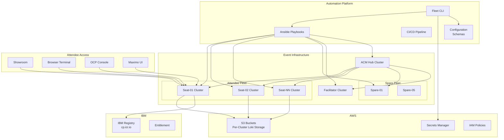
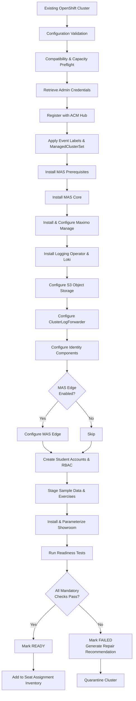
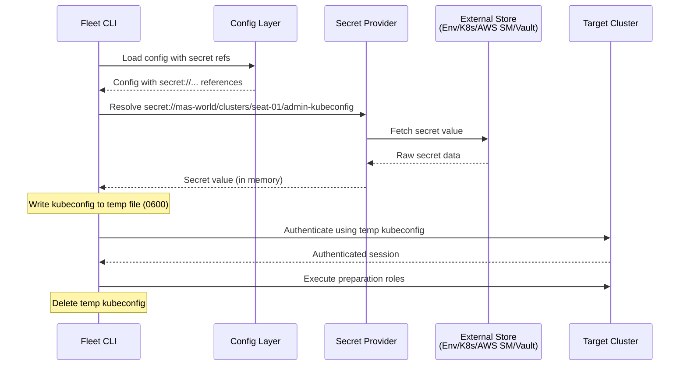
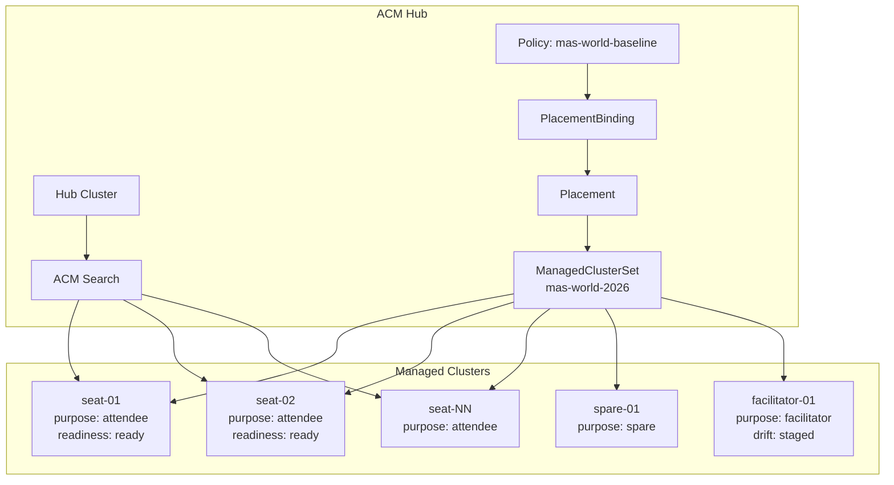
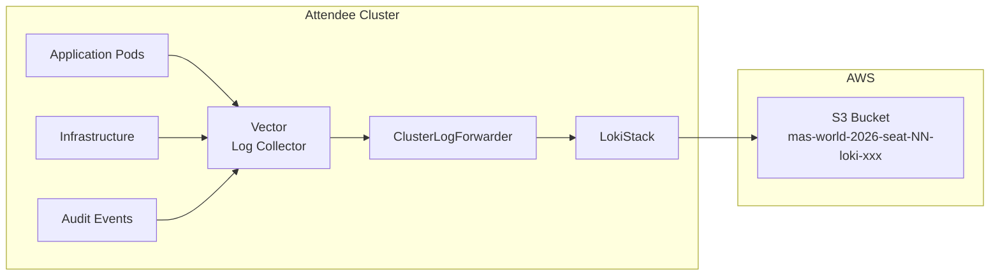
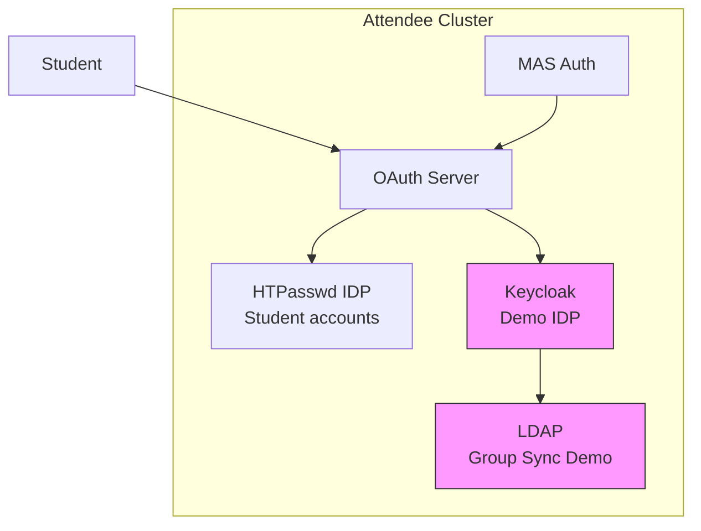
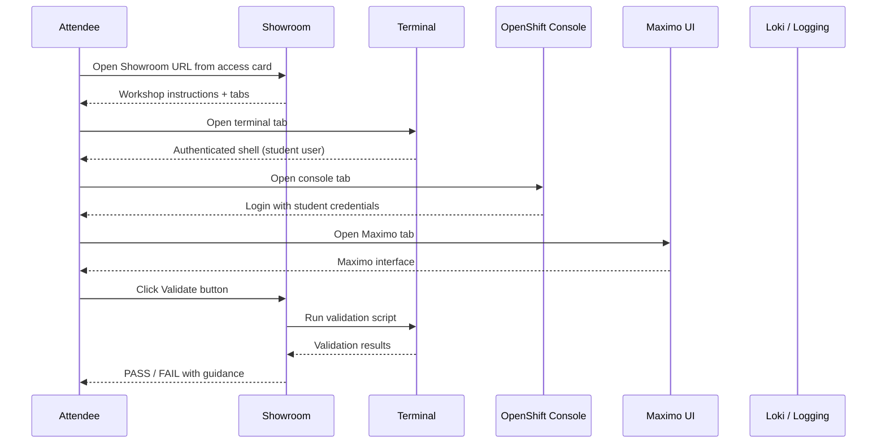
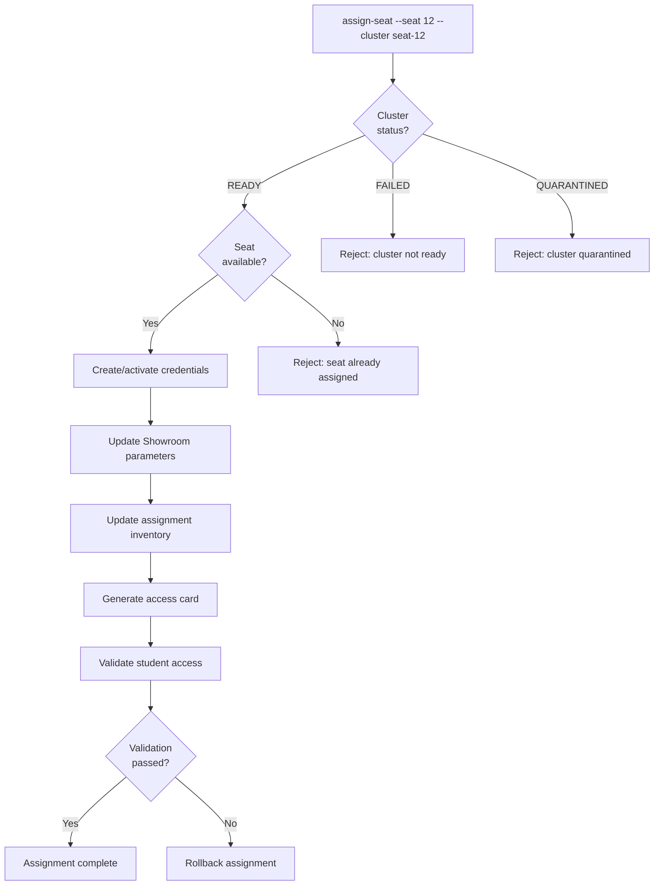
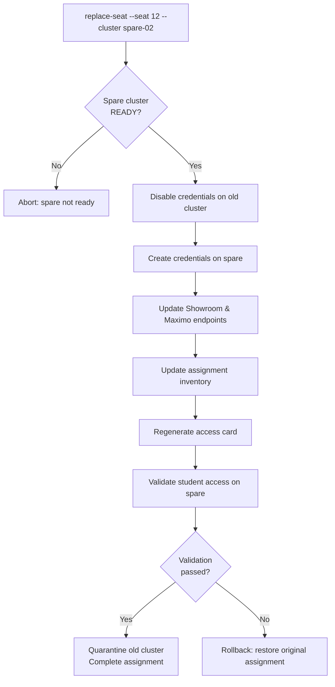
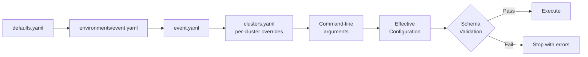

# Architecture Document — MAS World 2026

**Status**: DRAFT — Phase 0  
**Date**: 2026-07-19

---

## 1. System Context



---

## 2. Cluster Preparation Flow



---

## 3. Repository Architecture

```text
maximo-world/                          # Monorepo root
│
├── docs/                              # Cross-cutting documentation
│   ├── discovery-report.md
│   ├── compatibility-matrix.md
│   ├── architecture.md                # This document
│   ├── configuration-model.md
│   ├── credential-lifecycle.md
│   ├── risk-register.md
│   ├── implementation-plan.md
│   ├── threat-model.md
│   ├── adr/                           # Architecture Decision Records
│   └── ...
│
├── mas-world-2026-automation/         # Primary automation
│   ├── ansible.cfg
│   ├── galaxy.yml                     # Ansible collection metadata
│   ├── requirements.yml               # Ansible Galaxy dependencies
│   ├── pyproject.toml                 # Python project (CLI, plugins, tests)
│   ├── Makefile
│   ├── config/                        # Configuration hierarchy
│   ├── inventory/                     # Dynamic inventory
│   ├── schemas/                       # JSON Schema for config validation
│   ├── playbooks/                     # Ansible playbooks
│   ├── roles/                         # Ansible roles (17 roles)
│   ├── plugins/                       # Ansible plugins (filters, lookups)
│   ├── cli/                           # Python CLI (mas-world command)
│   ├── scripts/                       # Shell utilities
│   ├── tests/                         # Unit, integration, security tests
│   └── molecule/                      # Ansible Molecule test scenarios
│
├── mas-world-2026-showroom/           # Attendee workshop content
│   ├── content/modules/ROOT/          # Antora content
│   │   ├── nav.adoc
│   │   ├── pages/                     # Workshop pages (9 pages)
│   │   └── partials/                  # Reusable content fragments
│   ├── runtime-automation/            # Validate/solve/reset per module
│   ├── site.yml                       # Antora site configuration
│   └── ui-config.yml                  # Showroom UI configuration
│
├── mas-world-2026-public-content/     # Sanitized reusable examples
│   ├── operators/
│   ├── logging/
│   ├── identity/
│   └── ...
│
├── mas-world-2026-acm/               # ACM hub configuration
│   ├── managedclustersets/
│   ├── policies/
│   ├── placements/
│   └── demo-assets/
│
├── mas-world-2026-agnosticv/          # AgnosticV catalog
│
└── mas-world-2026-operations/         # Operational tooling
    ├── seat-assignment/
    ├── fleet-dashboard/
    ├── runbooks/
    └── ...
```

---

## 4. Automation Architecture

### 4.1 Ansible Collection Structure

The automation is packaged as an Ansible collection:
`masworld.automation`

```text
roles/
├── config_validation     # Validate configuration before execution
├── cluster_preflight     # Check cluster compatibility and capacity
├── event_metadata        # Apply labels and event markers
├── acm_registration      # Register cluster with ACM hub
├── mas_prerequisites     # Install MAS prerequisites (cert-manager, MongoDB, etc.)
├── mas_core              # Install MAS Core operator and Suite CR
├── maximo_manage          # Install and activate Maximo Manage
├── logging_operator      # Install Red Hat OpenShift Logging Operator
├── loki_stack            # Install Loki Operator and LokiStack
├── log_forwarding        # Configure ClusterLogForwarder
├── identity_demo         # Configure Keycloak and identity resources
├── mas_edge              # Configure MAS Edge (when enabled)
├── student_accounts      # Create student accounts, RBAC, htpasswd
├── sample_workloads      # Deploy exercise workloads and sample data
├── showroom              # Install and parameterize Showroom
├── event_readiness       # Run readiness checks
└── environment_report    # Generate cluster and fleet reports
```

### 4.2 Playbook Architecture

```text
playbooks/
├── prepare-fleet.yml         # Orchestrate full fleet preparation
├── prepare-cluster.yml       # Prepare a single cluster (all roles)
├── validate-fleet.yml        # Run readiness checks across fleet
├── validate-cluster.yml      # Run readiness checks on one cluster
├── repair-cluster.yml        # Repair specific failed components
├── reset-exercises.yml       # Reset exercise state for a module
├── rotate-credentials.yml    # Rotate student credentials
└── decommission-workshop.yml # Post-event teardown
```

### 4.3 CLI Architecture

```text
cli/
├── __init__.py
├── main.py                   # Click CLI entry point
├── commands/
│   ├── config.py             # validate-config, render-effective-config
│   ├── fleet.py              # prepare-fleet, validate-fleet
│   ├── cluster.py            # prepare-cluster, validate-cluster, repair-cluster
│   ├── students.py           # create/rotate/disable/delete student accounts
│   ├── seats.py              # assign/replace/unassign/show/export seats
│   ├── exercises.py          # reset-exercise
│   └── reports.py            # generate-seat-report, fleet-status
├── config/
│   ├── loader.py             # Configuration loading and merging
│   ├── schema.py             # Pydantic models
│   └── validator.py          # Configuration validation
├── secrets/
│   ├── provider.py           # SecretProvider ABC
│   ├── env_provider.py       # Environment variable provider
│   ├── k8s_provider.py       # Kubernetes Secrets provider
│   ├── aws_sm_provider.py    # AWS Secrets Manager provider
│   └── vault_provider.py     # HashiCorp Vault provider (optional)
├── inventory/
│   ├── manager.py            # Cluster inventory management
│   └── dynamic.py            # Ansible dynamic inventory script
├── orchestration/
│   ├── fleet.py              # Parallel fleet execution
│   ├── retry.py              # Retry with backoff
│   └── state.py              # State tracking and resume
└── reporting/
    ├── fleet_status.py       # Fleet dashboard data
    ├── seat_map.py           # Seat assignment report
    └── access_cards.py       # Access card generation
```

---

## 5. Secret Flow



---

## 6. ACM Topology



---

## 7. Logging Topology



---

## 8. Identity Topology



---

## 9. Attendee Access Flow



---

## 10. Seat Assignment Flow



---

## 11. Spare Replacement Flow



---

## 12. Configuration Precedence Flow


