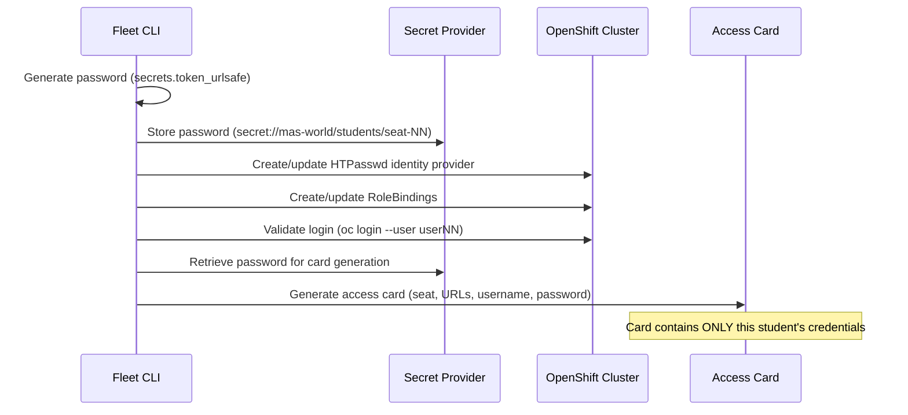
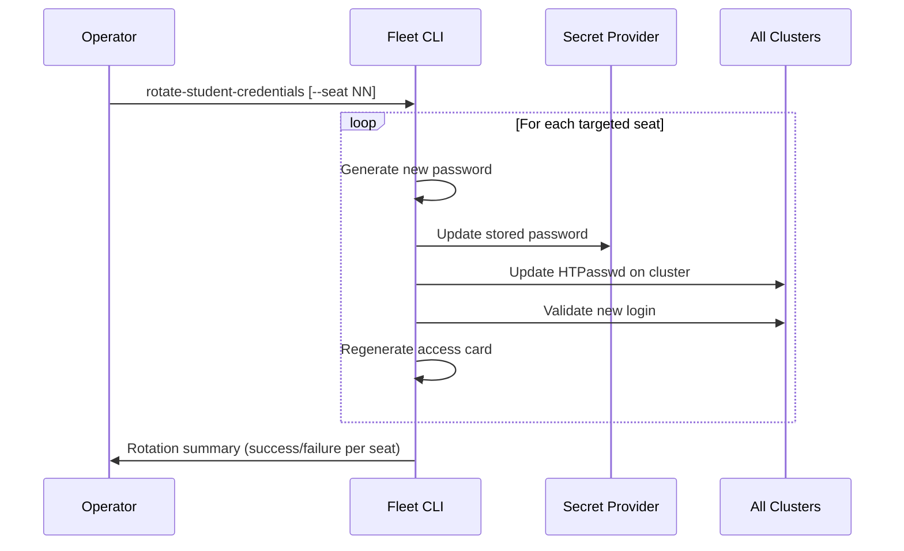

# Credential Lifecycle Design — MAS World 2026

**Status**: DRAFT — Phase 0
**Date**: 2026-07-19

---

## 1. Credential Categories

### 1.1 Administrative Credentials

| Credential | Scope | Lifetime | Storage |
|-----------|-------|----------|---------|
| Cluster kubeconfig | Per cluster | Provisioning → teardown | Secret provider |
| Cluster-admin token | Per cluster | Generated per operation | In-memory only |
| ACM hub admin password | Hub cluster (optional) | Provisioning → teardown | Secret provider |
| AWS IAM credentials | Per account/role | Rotation schedule | Secret provider |
| IBM Entitlement Key | Global | IBM-managed | Secret provider |
| MAS License | Global | IBM-managed | Secret provider |
| Container registry credentials | Global | Rotation schedule | Secret provider |

### 1.2 Service Credentials

| Credential | Scope | Lifetime | Storage |
|-----------|-------|----------|---------|
| S3 bucket IAM keys | Per cluster | Creation → post-event revocation | Secret provider → K8s Secret |
| Database credentials | Per cluster | Creation → post-event revocation | Secret provider → K8s Secret |
| Keycloak admin password | Per cluster | Creation → post-event revocation | Secret provider → K8s Secret |
| MAS system credentials | Per cluster | MAS-generated | K8s Secret (MAS-managed) |

### 1.3 Student Credentials

| Credential | Scope | Lifetime | Storage |
|-----------|-------|----------|---------|
| Student password | Per student per cluster | Generation → post-event deletion | Secret provider |
| Facilitator password | Per facilitator per cluster | Generation → post-event deletion | Secret provider |
| Presenter password | Per presenter per cluster | Generation → post-event deletion | Secret provider |

---

## 2. Secret Provider Abstraction

### 2.1 Architecture

```text
┌─────────────────────────────────────────────┐
│           Automation Code                    │
│                                              │
│   secret_ref = "secret://mas-world/..."      │
│           │                                  │
│           ▼                                  │
│   ┌───────────────────┐                      │
│   │  SecretProvider    │                      │
│   │  (Python ABC)      │                      │
│   └───────┬───────────┘                      │
│           │                                  │
│     ┌─────┼─────────┬──────────┐             │
│     ▼     ▼         ▼          ▼             │
│   Env   K8s     AWS Secrets  Vault           │
│   Vars  Secrets  Manager    (optional)       │
└─────────────────────────────────────────────┘
```

### 2.2 Provider Interface

```python
class SecretProvider(ABC):
    @abstractmethod
    def get_secret(self, ref: str) -> str:
        """Retrieve a secret value. Never cache to disk."""

    @abstractmethod
    def set_secret(self, ref: str, value: str) -> None:
        """Store a secret value."""

    @abstractmethod
    def delete_secret(self, ref: str) -> None:
        """Delete a secret value."""

    @abstractmethod
    def exists(self, ref: str) -> bool:
        """Check if a secret exists without retrieving it."""
```

### 2.3 Secret Reference Format

```text
secret://<namespace>/<category>/<identifier>[/<field>]
```

Examples:
```text
secret://mas-world/clusters/seat-01/admin-kubeconfig
secret://mas-world/students/seat-01/password
secret://mas-world/ibm/entitlement-key
secret://mas-world/clusters/seat-01/AWS_ACCESS_KEY_ID
secret://mas-world/clusters/seat-01/AWS_ACCESS_KEY_SECRET
secret://mas-world/facilitators/facilitator1/password
```

### 2.4 Provider Selection

| Environment | Provider | Configuration |
|-------------|----------|---------------|
| Local development | `env` | Environment variables with `MAS_WORLD_` prefix |
| CI/CD | `env` or `k8s` | Pipeline secrets or in-cluster Secrets |
| Cluster automation | `k8s` or `aws-sm` | Namespace-scoped Secrets or AWS Secrets Manager |
| Production-grade | `aws-sm` or `vault` | AWS Secrets Manager or HashiCorp Vault |

Provider is selected via configuration:
```yaml
secrets:
  provider: env  # env | file | k8s | aws-sm | vault
  config:
    # Provider-specific options
    aws_region: us-east-2
    vault_addr: https://vault.example.com
```

---

## 3. Credential Lifecycle Phases

### 3.1 Pre-Event Preparation

```text
┌─────────────────┐
│ Generate student │
│ passwords        │◄── Cryptographically secure random
└────────┬────────┘
         │
         ▼
┌─────────────────┐
│ Store in secret  │
│ provider         │◄── secret://mas-world/students/seat-NN/password
└────────┬────────┘
         │
         ▼
┌─────────────────┐
│ Create htpasswd  │
│ on cluster       │◄── HTPasswd identity provider
└────────┬────────┘
         │
         ▼
┌─────────────────┐
│ Configure RBAC   │
│                  │◄── ClusterRoleBindings, RoleBindings
└────────┬────────┘
         │
         ▼
┌─────────────────┐
│ Validate login   │
│ and access       │◄── Positive and negative tests
└────────┬────────┘
         │
         ▼
┌─────────────────┐
│ Generate access  │
│ cards            │◄── Per-student, contains only their credentials
└─────────────────┘
```

### 3.2 Pre-Event Rotation

```text
Trigger: Manual command or scheduled job (≤24h before event)

1. Generate new passwords for all students
2. Update secret provider
3. Update htpasswd on all clusters
4. Validate all logins
5. Regenerate access cards
6. Invalidate any previously distributed cards
```

### 3.3 Event Day

```text
Normal operation:
- No credential changes unless incident

Incident response:
- Rotate single compromised credential: rotate-student-credentials --seat NN
- Disable lost/exposed account: disable-student-accounts --seat NN
- Replace cluster: replace-seat --seat NN --cluster spare-XX
  (creates new credentials on replacement, invalidates old)
```

### 3.4 Post-Event Cleanup

```text
1. Disable all student accounts (disable htpasswd, remove RoleBindings)
2. Revoke S3 IAM credentials
3. Revoke database credentials
4. Remove temporary kubeconfigs
5. Delete student passwords from secret provider
6. Verify no active sessions remain
7. Unregister from ACM (if applicable)
8. Produce audit log of credential operations
```

---

## 4. Security Controls

### 4.1 Password Generation

```python
import secrets
import string

ALPHABET = string.ascii_letters + string.digits + "!@#$%^&*"
MIN_LENGTH = 18

def generate_password(length: int = MIN_LENGTH) -> str:
    while True:
        password = ''.join(secrets.choice(ALPHABET) for _ in range(length))
        if (any(c.islower() for c in password)
            and any(c.isupper() for c in password)
            and any(c.isdigit() for c in password)
            and any(c in "!@#$%^&*" for c in password)):
            return password
```

### 4.2 Secret Redaction

All output paths must redact secrets. Redaction patterns:

```python
REDACTION_PATTERNS = [
    r'password["\s:=]+\S+',
    r'token["\s:=]+\S+',
    r'secret["\s:=]+\S+',
    r'key["\s:=]+\S+',
    r'kubeconfig["\s:=]+\S+',
    r'AKIA[0-9A-Z]{16}',           # AWS access key
    r'eyJ[A-Za-z0-9_-]{10,}\.',    # JWT token
    r'sha256:[a-f0-9]{64}',        # SHA256 hash
]
```

### 4.3 Temporary File Handling

```python
import tempfile
import os

def with_kubeconfig(secret_ref: str, callback):
    """Execute callback with a temporary kubeconfig file."""
    kubeconfig_data = secret_provider.get_secret(secret_ref)
    fd, path = tempfile.mkstemp(prefix='mas-kc-', suffix='.yaml')
    try:
        os.fchmod(fd, 0o600)
        os.write(fd, kubeconfig_data.encode())
        os.close(fd)
        return callback(path)
    finally:
        os.unlink(path)
```

### 4.4 Audit Trail

Every credential operation must be logged:

```json
{
  "timestamp": "2026-08-16T18:00:00Z",
  "operation": "create_student_credential",
  "seat": "01",
  "cluster": "seat-01",
  "username": "user01",
  "operator": "automation",
  "result": "success"
}
```

Secret values are never logged. Only the operation, identity, and result.

---

## 5. Shared Password Policy

```yaml
student_credentials:
  allow_shared_password: false
```

When `allow_shared_password: true` is set (development/rehearsal only):

```text
⚠️  WARNING: Shared student passwords are enabled.
⚠️  This configuration is NOT suitable for event use.
⚠️  Every attendee will have the same password.
⚠️  Set allow_shared_password: false before the event.
```

---

## 6. Credential Flow Diagrams

### Student Password Flow



### Credential Rotation Flow


