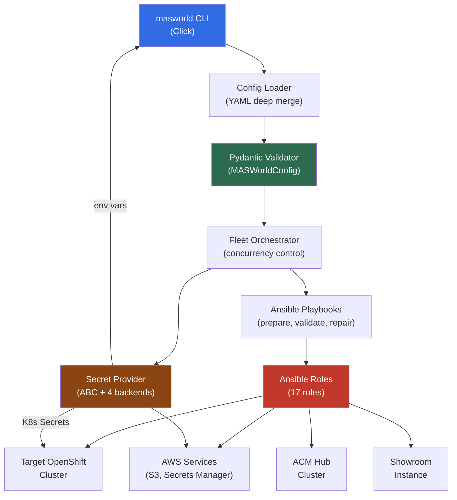
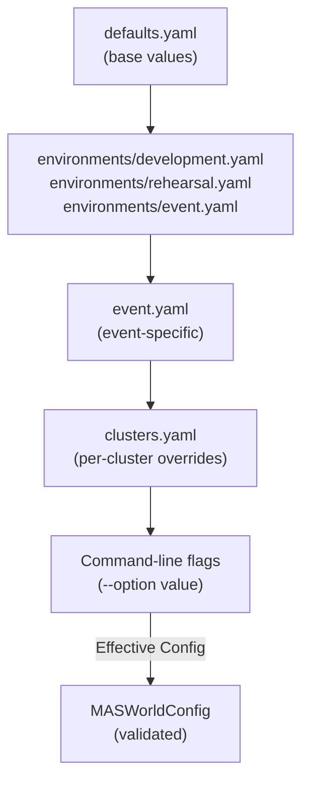
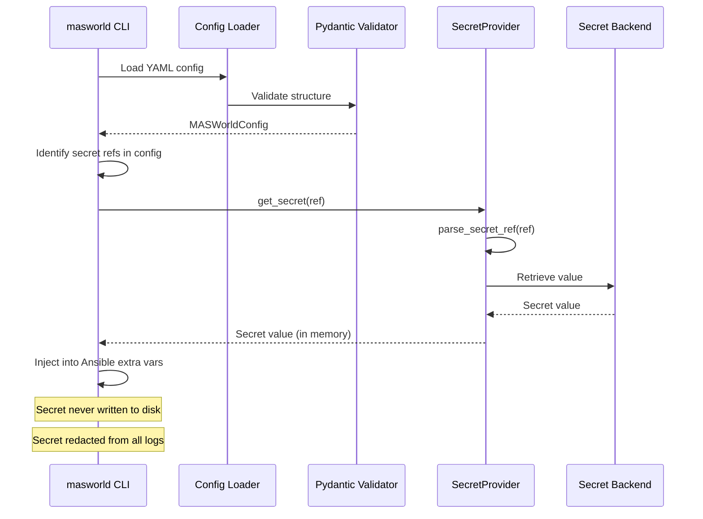
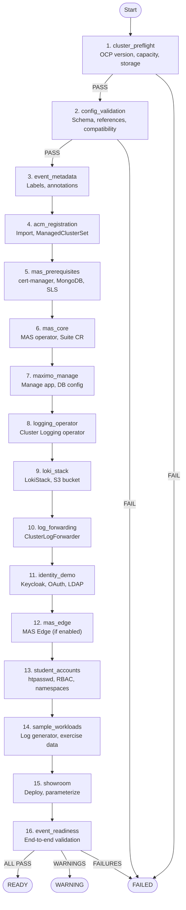
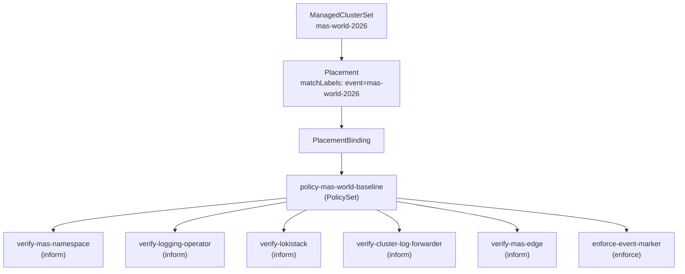
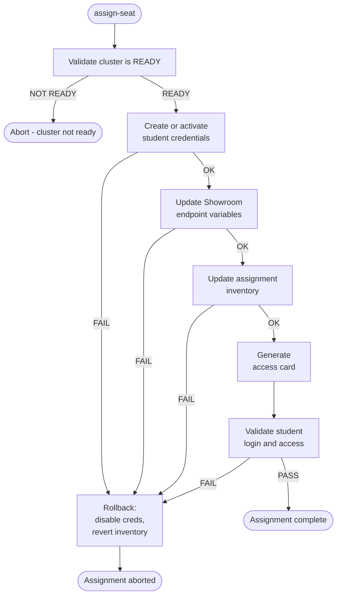
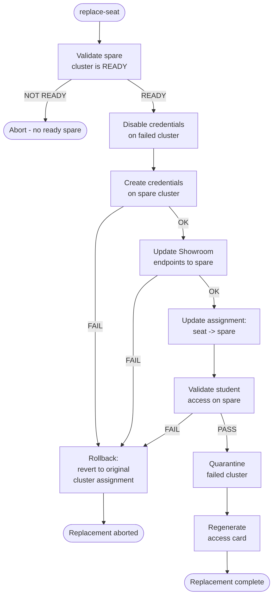
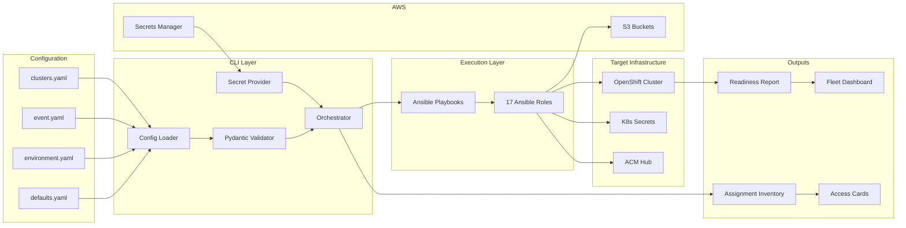
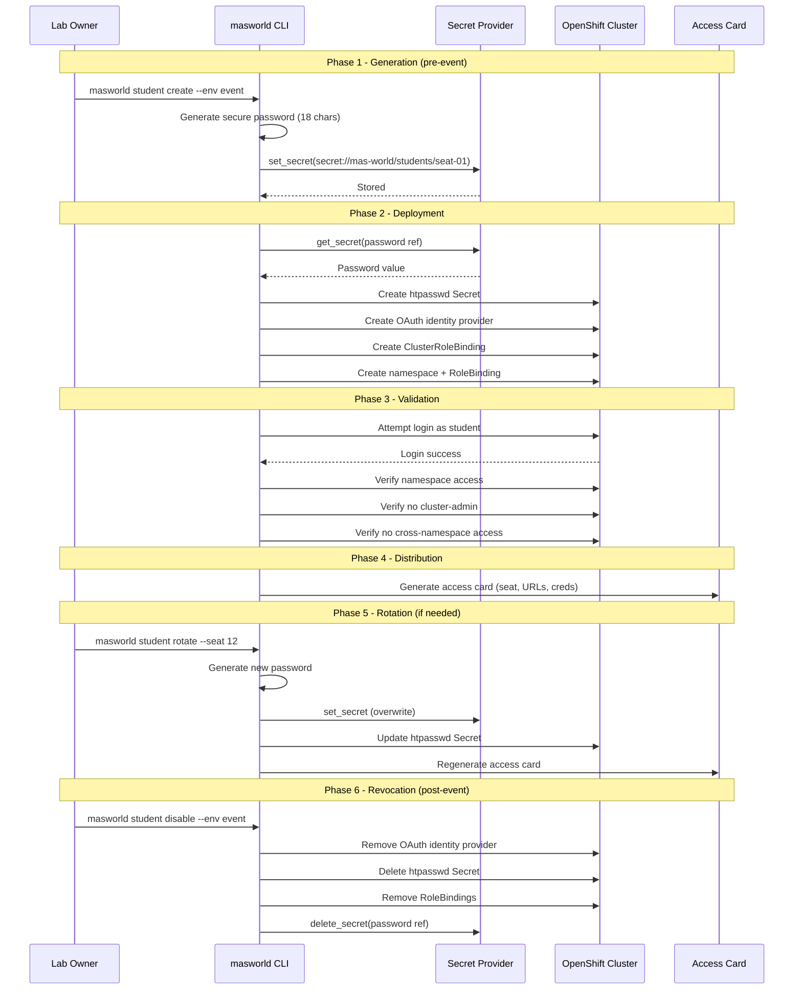

# Technical Design Document — MAS World 2026

**Status**: DRAFT — Phase 1
**Date**: 2026-07-19

---

## 1. System Overview

The MAS World 2026 automation system transforms pre-provisioned OpenShift
clusters into fully configured IBM Maximo Application Suite workshop
environments. The system supports up to 50 attendee clusters, spare clusters,
and facilitator clusters, all managed through Red Hat Advanced Cluster
Management from a central hub.

The automation stack consists of:

- A Python CLI (`masworld`) built with Click for operator interaction
- An Ansible collection (`masworld.automation`) with 17 roles for cluster
  configuration
- Pydantic-based configuration validation with JSON Schema generation
- A secret-provider abstraction supporting four backends
- Per-cluster preparation pipelines with state tracking and resume capability
- Fleet orchestration with configurable concurrency and failure isolation

The system is designed for three deployment contexts — development (1 cluster),
rehearsal (5-7 clusters), and event (50+ clusters) — using identical code with
different configuration.

---

## 2. Component Interaction



**Data flow**: The CLI loads layered YAML configuration, validates it through
Pydantic models, resolves secret references at runtime, and hands the effective
configuration to the fleet orchestrator. The orchestrator manages parallel
Ansible playbook execution across the cluster inventory with concurrency
limits, timeouts, and retry logic.

---

## 3. Configuration Model

### 3.1 Layered YAML Configuration

Configuration follows a strict precedence hierarchy where each layer can
override values from the layer below:



| Layer | File | Purpose |
|-------|------|---------|
| 1 - Defaults | `config/defaults.yaml` | Base values for all settings |
| 2 - Environment | `config/environments/{env}.yaml` | Fleet size, concurrency, feature flags |
| 3 - Event | `config/event.yaml` | Event-specific metadata, date, timezone |
| 4 - Cluster | `config/clusters.yaml` | Per-cluster connection, endpoints, overrides |
| 5 - CLI | `--option value` | Runtime overrides for specific invocations |

**Deep merge strategy**: Dictionaries are recursively merged (lower layer keys
are preserved when not overridden). Lists are replaced entirely (not appended).
Scalar values are overridden by higher-precedence layers. The merge is
deterministic and documented.

### 3.2 Pydantic Models

The configuration model is defined in `cli/config/schema.py` using Pydantic v2
`BaseModel` classes with field validators and model validators.

| Model | Purpose | Key Fields |
|-------|---------|------------|
| `MASWorldConfig` | Root configuration | event, fleet, components, clusters, secrets, aws |
| `EventConfig` | Event metadata | id, name, date, timezone |
| `FleetConfig` | Fleet sizing | attendee/spare/facilitator counts, preparation, assignment |
| `PreparationConfig` | Orchestration tuning | max_concurrent_clusters, timeout, retry_count |
| `ClusterConfig` | Per-cluster definition | id, purpose, connection, platform, endpoints, overrides |
| `ClusterConnection` | Cluster access | api_url, admin_auth_method, admin_secret_ref |
| `ComponentsConfig` | Feature enablement | mas, logging, loki, keycloak, mas_edge, showroom, acm |
| `MASComponentConfig` | MAS settings | version, channel, install_core, install_manage |
| `LoggingComponentConfig` | Logging settings | collector, collect_application/infrastructure/audit |
| `LokiComponentConfig` | Loki settings | object_storage_mode, size, retention_days |
| `StudentCredentialProfile` | Account template | username_template, password config, access, restrictions |
| `SecretProviderConfig` | Secret backend | provider type (env, k8s, aws-sm, vault), backend config |
| `AWSConfig` | AWS settings | region, s3_bucket_prefix, encryption, lifecycle |

**Cross-field validation** is enforced at the `MASWorldConfig` level:

- No duplicate cluster IDs
- No duplicate seat numbers
- No attendee profile grants cluster-admin
- Shared password warning emitted when enabled

### 3.3 JSON Schema Generation

Pydantic v2 models expose `model_json_schema()` to produce JSON Schema draft
2020-12 output. The generated schemas are stored in `schemas/` and used for:

- IDE autocompletion in YAML editors
- CI validation of configuration files
- Pre-commit checks before fleet operations
- Documentation generation

```text
schemas/
  mas-world-config.schema.json
  cluster-config.schema.json
  student-credential-profile.schema.json
```

---

## 4. Secret Management Architecture

### 4.1 SecretProvider Abstraction

The secret provider is defined as an abstract base class in
`cli/secrets/provider.py` with four concrete implementations:

```text
SecretProvider (ABC)
  get_secret(ref) -> str
  set_secret(ref, value) -> None
  delete_secret(ref) -> None
  exists(ref) -> bool

EnvSecretProvider         -- cli/secrets/env_provider.py
K8sSecretProvider         -- cli/secrets/k8s_provider.py
AWSSecretsManagerProvider -- cli/secrets/aws_sm_provider.py
VaultSecretProvider       -- cli/secrets/vault_provider.py
```

| Provider | Backend | Use Case |
|----------|---------|----------|
| `EnvSecretProvider` | Environment variables | Local development, CI |
| `K8sSecretProvider` | Kubernetes Secrets | In-cluster automation |
| `AWSSecretsManagerProvider` | AWS Secrets Manager | Event and rehearsal |
| `VaultSecretProvider` | HashiCorp Vault | Enterprise integration |

Secret references use the URI scheme `secret://namespace/path`:

```text
secret://mas-world/clusters/seat-01/admin-kubeconfig
secret://mas-world/students/seat-01
secret://mas-world/ibm/entitlement
secret://mas-world/aws/s3/seat-01
```

### 4.2 Secret Resolution Flow



### 4.3 Temporary Kubeconfig Handling

When cluster authentication requires a kubeconfig file on disk (for tools
that do not support in-memory credentials):

1. Create an isolated temporary directory with `tempfile.mkdtemp()`.
2. Write the kubeconfig with mode `0600`.
3. Set `KUBECONFIG` environment variable for the subprocess only.
4. Delete the file and directory immediately after the operation completes.
5. Never reuse the same temporary path across concurrent cluster operations.
6. Never log the kubeconfig contents.

### 4.4 Redaction Patterns

All logging and output passes through a redaction filter that masks values
matching these patterns:

| Pattern | Description |
|---------|-------------|
| `secret://...` | Secret reference URIs |
| `eyJ...` (base64 JWT) | Bearer tokens |
| `AKIA[A-Z0-9]{16}` | AWS access key IDs |
| `sha256~...` | OpenShift OAuth tokens |
| Known password field values | From student credential profiles |
| IBM entitlement key pattern | `[a-zA-Z0-9_-]{40,}` in entitlement contexts |

---

## 5. Automation Pipeline

### 5.1 Cluster Preparation Flow



### 5.2 Role Execution Order and Dependencies

| Order | Role | Depends On | Blocking |
|-------|------|-----------|----------|
| 1 | `cluster_preflight` | None | Yes |
| 2 | `config_validation` | None | Yes |
| 3 | `event_metadata` | preflight | No |
| 4 | `acm_registration` | preflight, metadata | No |
| 5 | `mas_prerequisites` | preflight | Yes |
| 6 | `mas_core` | mas_prerequisites | Yes |
| 7 | `maximo_manage` | mas_core | Yes |
| 8 | `logging_operator` | preflight | No |
| 9 | `loki_stack` | logging_operator | No |
| 10 | `log_forwarding` | loki_stack | No |
| 11 | `identity_demo` | preflight | No |
| 12 | `mas_edge` | mas_core | No |
| 13 | `student_accounts` | preflight | Yes |
| 14 | `sample_workloads` | logging, student_accounts | No |
| 15 | `showroom` | all prior roles | No |
| 16 | `event_readiness` | all prior roles | Yes |

**Blocking** roles cause the pipeline to abort for that cluster if they fail.
Non-blocking roles record a WARNING and allow the pipeline to continue.

### 5.3 State Tracking and Resume Capability

Each cluster maintains a state file recording the last completed stage:

```yaml
cluster_id: seat-01
last_completed_stage: 10
last_completed_role: log_forwarding
last_run_timestamp: "2026-08-15T14:32:00Z"
status: IN_PROGRESS
stages_completed:
  - cluster_preflight
  - config_validation
  - event_metadata
  - acm_registration
  - mas_prerequisites
  - mas_core
  - maximo_manage
  - logging_operator
  - loki_stack
  - log_forwarding
stages_pending:
  - identity_demo
  - mas_edge
  - student_accounts
  - sample_workloads
  - showroom
  - event_readiness
```

When `--resume` is passed, the orchestrator reads the state file and skips
completed stages. Each role is idempotent, so re-executing a completed stage
is safe but unnecessary.

### 5.4 Retry with Exponential Backoff

Transient failures (API timeouts, registry rate limits, DNS resolution)
trigger automatic retry:

```text
Attempt 1: immediate
Attempt 2: wait 30s
Attempt 3: wait 60s
Attempt 4: wait 120s (if retry_count > 3)
```

The base wait is configurable via `preparation.retry_backoff_base_seconds`.
The formula is `base * 2^(attempt - 1)` capped at 300 seconds. Permanent
failures (authentication errors, missing CRDs, insufficient capacity) are
not retried.

---

## 6. CLI Architecture

### 6.1 Command Groups

The CLI is built with Click and organized into seven command groups:

```text
masworld
  config
    validate          Validate all configuration files
    render            Render effective merged config (secrets redacted)
    diff              Show differences between environments
    schema            Export JSON Schema
  cluster
    prepare           Prepare a single cluster
    validate          Validate a single cluster
    repair            Repair a single cluster
    status            Show cluster status
    preflight         Run preflight checks only
  fleet
    prepare           Prepare all clusters in inventory
    validate          Validate all clusters
    status            Show fleet status summary
  student
    create            Create student accounts on a cluster
    rotate            Rotate student credentials
    disable           Disable student accounts
    delete            Delete student accounts
    validate-access   Validate student login and RBAC
  seat
    assign            Assign a seat to a cluster
    replace           Replace a seat cluster with a spare
    unassign          Unassign a seat
    show              Show seat details
    export            Export seat map (CSV, JSON)
  exercise
    reset             Reset an exercise module on a cluster
    validate          Validate an exercise module
    solve             Run the solve automation for a module
  report
    fleet-status      Generate fleet status report
    readiness         Generate readiness report
    access-cards      Generate attendee access cards
    seat-map          Generate seat assignment map
```

### 6.2 Config Loading and Injection

Every command that requires configuration follows this sequence:

1. Resolve the configuration directory from `--config-dir` or `MAS_WORLD_CONFIG_DIR`.
2. Load `defaults.yaml`.
3. Load `environments/{env}.yaml` based on `--env`.
4. Load `event.yaml`.
5. Load `clusters.yaml`.
6. Deep-merge all layers.
7. Apply command-line overrides.
8. Validate through `MASWorldConfig`.
9. Initialize the configured `SecretProvider`.
10. Pass the validated config through Click context (`ctx.obj`).

### 6.3 Error Handling and Exit Codes

| Exit Code | Meaning |
|-----------|---------|
| 0 | Success |
| 1 | General error |
| 2 | Configuration validation failure |
| 3 | Cluster preparation failure |
| 4 | Authentication or secret retrieval failure |
| 5 | Partial fleet failure (some clusters failed) |
| 10 | Timeout |
| 20 | Dry-run completed (no changes made) |

### 6.4 Structured JSON Logging

All CLI output supports two modes:

- **Human-readable** (default): colored console output with progress bars
- **Structured JSON** (`--output json`): one JSON object per event, suitable
  for log aggregation and CI parsing

```json
{
  "timestamp": "2026-08-15T14:32:00Z",
  "level": "info",
  "cluster_id": "seat-01",
  "stage": "mas_core",
  "message": "MAS Core installation complete",
  "duration_seconds": 1842,
  "attempt": 1
}
```

Secret values are never included in log output regardless of log level.

---

## 7. Showroom Integration

### 7.1 Per-Cluster Parameterization

Each cluster receives a unique set of Showroom variables generated from the
cluster inventory and seat assignment:

| Variable | Source | Example |
|----------|--------|---------|
| `showroom_seat_number` | Assignment inventory | `01` |
| `showroom_cluster_id` | Cluster config | `seat-01` |
| `showroom_ocp_console_url` | Cluster endpoints | `https://console-openshift-console.apps.seat-01.example.com` |
| `showroom_ocp_api_url` | Cluster connection | `https://api.seat-01.example.com:6443` |
| `showroom_mas_url` | Cluster endpoints | `https://masdev.apps.seat-01.example.com` |
| `showroom_logging_url` | Cluster endpoints | `https://logging.apps.seat-01.example.com` |
| `showroom_student_username` | Credential profile | `user01` |
| `showroom_student_password` | Secret provider | (resolved at runtime, never stored in config) |

### 7.2 Runtime Automation

Each lab module has associated playbooks stored in
`showroom/runtime-automation/`:

```text
runtime-automation/
  readiness/
    validate.yml          One-click environment readiness check
  navigation/
    prepare.yml           Stage navigation exercise resources
    validate.yml          Check exercise completion
    solve.yml             Auto-complete the exercise
  acm/
    validate.yml          Verify ACM marker on attendee cluster
  updates/
    prepare.yml           Stage the update exercise
    validate.yml          Check update exercise completion
    solve.yml             Auto-complete the update exercise
    reset.yml             Reset to pre-exercise state
  observability/
    prepare.yml           Deploy log-generator workload
    validate.yml          Check log query exercise completion
    solve.yml             Auto-complete the logging exercise
    reset.yml             Remove log-generator, reset state
  identity/
    prepare.yml           Stage identity inspection resources
    validate.yml          Check identity exercise completion
    solve.yml             Auto-complete the identity exercise
    reset.yml             Reset identity exercise state
```

These playbooks run with a scoped service account (not cluster-admin) and
produce attendee-friendly output that does not reveal sensitive data.

### 7.3 UI Configuration

Showroom tabs are defined in `ui-config.yml` using environment-variable
substitution:

| Tab | Type | Target |
|-----|------|--------|
| Workshop | Showroom content | Built-in |
| Terminal | Browser terminal | `ttyd` or Showroom terminal service |
| OpenShift Console | iframe | `%ocp_console_url%` |
| Maximo | iframe | `%mas_url%` |
| Logging | iframe | `%logging_url%` |

No cluster-specific URLs are hard-coded in the UI configuration. All values
are injected through the Showroom deployment variables populated by the
`showroom` Ansible role.

---

## 8. ACM Policy Hierarchy

### 8.1 Policy Structure



### 8.2 Placement and PlacementBinding

All policies target clusters through a Placement resource that selects on
the `event: mas-world-2026` label. This ensures policies apply to attendee,
spare, and facilitator clusters uniformly.

```yaml
# Placement selects all event clusters
matchExpressions:
  - key: event
    operator: In
    values:
      - mas-world-2026
```

### 8.3 ManagedClusterSet

A single ManagedClusterSet named `mas-world-2026` groups all workshop
clusters. The ACM hub administrator binds this set to the event namespace for
policy and placement scope.

### 8.4 Drift Demonstration Design

The ACM demonstration uses a single facilitator cluster to show policy
noncompliance:

1. **Pre-stage**: A ConfigMap (`event-marker`) exists on all clusters. On the
   facilitator cluster, it is deliberately removed before the demo.
2. **Observe**: The presenter shows the compliance dashboard with one
   noncompliant cluster.
3. **Remediate**: The `enforce-event-marker` policy (set to `enforce` mode)
   automatically recreates the ConfigMap.
4. **Verify**: All clusters return to full compliance.

This approach is safe because:

- Only a ConfigMap is affected (no impact on MAS, logging, or OAuth)
- Only the facilitator cluster is made noncompliant
- The enforcement action is additive (create), not destructive
- The demonstration is repeatable (reset by deleting the ConfigMap again)

---

## 9. Fleet Orchestration

### 9.1 Parallel Execution Model

Fleet-level operations use Python `concurrent.futures.ThreadPoolExecutor` to
run cluster preparation in parallel. Each cluster operation is a separate
thread that spawns an `ansible-playbook` subprocess.

```text
Fleet Orchestrator
  ThreadPoolExecutor(max_workers=max_concurrent_clusters)
    Cluster seat-01: ansible-playbook prepare-cluster.yml
    Cluster seat-02: ansible-playbook prepare-cluster.yml
    Cluster seat-03: ansible-playbook prepare-cluster.yml
    ... (up to max_concurrent_clusters)
    Cluster seat-04: (queued, waiting for a slot)
```

### 9.2 Concurrency Control

| Setting | Default | Description |
|---------|---------|-------------|
| `max_concurrent_clusters` | 5 | Maximum clusters being prepared simultaneously |
| `per_cluster_timeout_minutes` | 240 | Abort a cluster operation after this duration |
| `retry_count` | 3 | Maximum retry attempts per stage |

Conservative defaults avoid saturating external APIs (AWS, IBM registry, ACM
hub). The concurrency limit applies per fleet operation, not globally.

### 9.3 Failure Isolation

A failure in one cluster does not block other clusters:

- Each cluster runs in an isolated thread with its own Ansible subprocess.
- Each cluster has its own temporary kubeconfig and log file.
- A failed cluster is marked `FAILED` and excluded from assignment.
- The orchestrator continues processing remaining clusters.
- A summary report lists all cluster statuses at completion.

### 9.4 Resume from Last Completed Stage

When a fleet preparation is interrupted or partially fails:

```bash
masworld fleet prepare --env event --resume
```

The orchestrator reads each cluster's state file and skips completed stages.
Clusters that completed successfully are skipped entirely. Clusters that
failed are retried from the last completed stage.

---

## 10. Seat Assignment Flow

### 10.1 Transactional Assignment



### 10.2 Spare Replacement



A failed replacement never leaves a seat pointing to an unvalidated cluster.
The inventory update and credential activation are atomic: if validation of
the new cluster fails, the original assignment is restored.

---

## 11. Data Flow



---

## 12. Credential Lifecycle



---

## Appendix A. Directory Structure Reference

```text
mas-world-2026-automation/
  ansible.cfg
  galaxy.yml
  requirements.yml
  pyproject.toml
  Makefile
  config/
    defaults.yaml
    event.yaml
    clusters.yaml
    credentials.yaml
    components.yaml
    aws.yaml
    showroom.yaml
    environments/
      development.yaml
      rehearsal.yaml
      event.yaml
  cli/
    main.py
    commands/
      config.py, cluster.py, fleet.py, students.py,
      seats.py, exercises.py, reports.py
    config/
      loader.py, schema.py, validator.py
    secrets/
      provider.py, env_provider.py, k8s_provider.py,
      aws_sm_provider.py, vault_provider.py
    orchestration/
  inventory/
  schemas/
  playbooks/
    prepare-fleet.yml, prepare-cluster.yml,
    validate-fleet.yml, validate-cluster.yml,
    repair-cluster.yml, reset-exercises.yml,
    rotate-credentials.yml, decommission-workshop.yml
  roles/
    cluster_preflight/    config_validation/
    event_metadata/       acm_registration/
    mas_prerequisites/    mas_core/
    maximo_manage/        logging_operator/
    loki_stack/           log_forwarding/
    identity_demo/        mas_edge/
    student_accounts/     sample_workloads/
    showroom/             event_readiness/
    environment_report/
  plugins/
  scripts/
  tests/
  molecule/
  docs/
```

## Appendix B. Technology Stack

| Layer | Technology | Version |
|-------|-----------|---------|
| CLI | Python + Click | Python 3.12, Click 8.x |
| Config validation | Pydantic | 2.x |
| Automation | Ansible | 2.16+ (ansible-core) |
| Collection | masworld.automation | 1.0.0 |
| Container platform | OpenShift | 4.22 EUS |
| MAS | IBM MAS | 9.1.x |
| MAS catalog | IBM MAS Catalog | v9-260625-amd64 |
| ACM | Red Hat ACM | 2.16+ |
| Logging | OpenShift Logging | 6.6 |
| Loki | Loki Operator | 6.6 |
| Object storage | AWS S3 | N/A |
| Secret management | AWS Secrets Manager | N/A |
| Identity | Keycloak | Bundled with OCP |
| Workshop UI | Red Hat Showroom | Current RHDP version |
