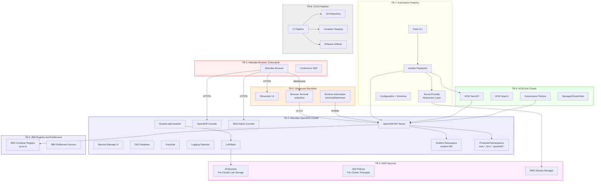

# Threat Model — MAS World 2026

**Status**: DRAFT — Phase 7
**Date**: 2026-07-19

---

## 1. Methodology

This threat model uses **STRIDE** (Spoofing, Tampering, Repudiation,
Information Disclosure, Denial of Service, Elevation of Privilege) applied to
each trust boundary and attack surface in the MAS World 2026 workshop
environment.

**Scope**: The model covers the full lifecycle of the workshop environment from
cluster preparation through event execution to post-event teardown. It
addresses 50 attendee clusters, 5 spare clusters, 1 facilitator cluster, and 1
ACM hub cluster, each running IBM Maximo Application Suite on OpenShift with
supporting services (Db2, Logging/Loki, Keycloak, Showroom).

**Threat actors considered**:

| Actor | Motivation | Capability |
|-------|-----------|------------|
| Curious attendee | Explore beyond assigned environment | OpenShift basic-user, browser terminal, Showroom access |
| Malicious attendee | Exfiltrate data, disrupt other attendees, escalate privileges | Same as curious attendee plus personal device on conference WiFi |
| Conference network eavesdropper | Intercept credentials or session tokens | Passive WiFi sniffing on shared conference network |
| External attacker | Compromise exposed services | Internet access to public routes (console, MAS, Showroom) |
| Compromised CI/CD | Inject malicious code or exfiltrate secrets | Access to pipeline secrets, container registry, Git |
| Insider with automation access | Misuse privileged credentials | Ansible automation credentials, secret provider access |

**Risk rating scale**:

| Level | Definition |
|-------|-----------|
| Critical | Credential exposure or cross-tenant data breach affecting multiple attendees |
| High | Single-attendee compromise, service disruption, or privilege escalation |
| Medium | Information leak without direct exploitation path, limited disruption |
| Low | Theoretical attack with significant barriers, minimal impact |

---

## 2. Trust Boundaries

### 2.1 Trust Boundary Diagram



### 2.2 Trust Boundary Descriptions

| ID | Boundary | Inside (Trusted) | Outside (Untrusted) | Data Crossing |
|----|----------|-------------------|---------------------|---------------|
| TB-1 | Attendee browser | Nothing | Attendee browser, personal device, conference WiFi | HTTPS requests, WebSocket frames, session cookies |
| TB-2 | Showroom boundary | Showroom UI, browser terminal process, runtime automation | Attendee browser session, attendee-executed commands | Terminal I/O, Showroom API calls, validation results |
| TB-3 | Attendee OpenShift cluster | OpenShift API, MAS, Db2, Keycloak, Logging, Loki, student namespace | Showroom terminal, attendee commands, ACM policies | API requests, kubectl/oc commands, log streams, S3 writes |
| TB-4 | ACM hub cluster | ACM API, Search, Governance, ManagedClusterSets | Attendee clusters (managed), presenter browser, automation | Cluster registration, policy distribution, search queries, compliance status |
| TB-5 | AWS services | S3 buckets, IAM policies, Secrets Manager | OpenShift clusters (Loki writers), automation platform | S3 API calls, IAM authentication, secret retrieval |
| TB-6 | IBM registry / entitlement | IBM container registry, entitlement validation | OpenShift clusters (image pulls) | Container image pulls, entitlement key validation |
| TB-7 | Automation platform | Fleet CLI, Ansible, secret provider, configuration | Operator workstation, CI/CD pipeline | Cluster API calls, secret retrievals, configuration reads |
| TB-8 | CI/CD pipeline | Git repository, build pipeline, container registry | Developer commits, external dependencies, base images | Source code, build artifacts, container images, release metadata |

---

## 3. Attack Surfaces

| ID | Attack Surface | Exposed To | Protocol | Authentication | Authorization |
|----|---------------|-----------|----------|----------------|---------------|
| AS-01 | Showroom browser terminal | Attendee | WebSocket over HTTPS | Showroom session (per-seat URL) | Shell user with `oc` CLI pre-authenticated as student |
| AS-02 | OAuth / htpasswd authentication | Attendee, external | HTTPS | htpasswd (username + generated password) | OpenShift OAuth server |
| AS-03 | S3 bucket access | OpenShift Loki (per cluster) | HTTPS (AWS S3 API) | IAM access key (per-cluster principal) | IAM policy scoped to single bucket |
| AS-04 | ACM hub API | Presenter, facilitators, automation | HTTPS | Kubeconfig / token | Cluster-admin (presenter), scoped roles (facilitators) |
| AS-05 | MAS admin console | Attendee (limited view), automation | HTTPS | MAS internal auth | MAS role assignments |
| AS-06 | OpenShift API server | Attendee (via terminal), automation | HTTPS | OAuth token (student), kubeconfig (automation) | RBAC: basic-user + namespace admin |
| AS-07 | Keycloak admin console | Automation only (not attendee-facing) | HTTPS | Admin password from secret provider | Keycloak admin realm role |
| AS-08 | Ansible automation credentials | Automation platform operators | SSH / HTTPS | Secret provider references | Operator workstation access |
| AS-09 | CI/CD pipeline | Developers, automated triggers | HTTPS | Git credentials, pipeline tokens | Branch protection, approval gates |
| AS-10 | Access card distribution | Attendee (physical / digital) | Physical or secure channel | Per-seat unique password | Seat number mapping |
| AS-11 | OpenShift Console | Attendee | HTTPS | OAuth session (student) | RBAC: basic-user + namespace admin |
| AS-12 | Container image registry | OpenShift clusters | HTTPS | IBM entitlement key, registry pull secrets | Image pull policy |

---

## 4. STRIDE Threat Analysis

| ID | Category | Threat | Attack Surface | Likelihood | Impact | Risk | Mitigation | Status |
|----|----------|--------|---------------|-----------|--------|------|-----------|--------|
| T-01 | Information Disclosure | Credential exposure in Ansible logs, CLI output, or CI artifacts | AS-08 | Medium | Critical | **CRITICAL** | `no_log: true` on all secret tasks; secret redaction patterns in CLI; CI log scrubbing; `SecretProvider` never returns values to stdout | Implemented |
| T-02 | Tampering / Elevation of Privilege | Cross-tenant namespace access: attendee accesses `student-NN` namespace belonging to another seat | AS-06, AS-01 | Medium | High | **HIGH** | Namespace-scoped RBAC; no `ClusterRole` granting cross-namespace access; `NetworkPolicy` isolating student namespaces; negative security test validates isolation | Implemented |
| T-03 | Elevation of Privilege | Privilege escalation to cluster-admin via RBAC misconfiguration, token theft, or impersonation | AS-06, AS-01 | Low | Critical | **HIGH** | Student accounts bound to `basic-user` ClusterRole only; no `cluster-admin` ClusterRoleBinding for student users; `allow_cluster_admin: false` enforced in credential profile; negative test validates | Implemented |
| T-04 | Information Disclosure / Tampering | S3 cross-cluster data access: Loki on cluster A reads/writes bucket belonging to cluster B | AS-03 | Low | High | **MEDIUM** | Per-cluster S3 buckets with dedicated IAM principals; IAM policy restricts each principal to exactly one bucket; negative test proves cross-bucket access denied | Implemented |
| T-05 | Elevation of Privilege | ACM admin access by attendee: attendee discovers or guesses ACM hub endpoint and attempts administrative operations | AS-04 | Low | Critical | **HIGH** | Attendees have no ACM credentials; ACM hub URL not exposed in Showroom; no `ManagedCluster` RBAC for student accounts; ACM hub firewall rules restrict API access; negative test validates | Implemented |
| T-06 | Tampering / Elevation of Privilege | Showroom terminal breakout: attendee escapes the browser terminal sandbox to access the host OS, other containers, or privileged API paths | AS-01 | Low | High | **MEDIUM** | Terminal runs as unprivileged container; no host mounts; `SecurityContextConstraints` prevent privilege escalation; `oc` pre-authenticated only as student user; no `sudo` or package managers available | Implemented |
| T-07 | Information Disclosure | IBM entitlement key leakage: entitlement key exposed in Git, logs, CI output, error messages, or cluster events | AS-08, AS-09 | Medium | Critical | **CRITICAL** | Key stored exclusively in secret provider (`secret://mas-world/ibm/entitlement-key`); injected at runtime via Ansible `no_log` task; pre-commit gitleaks scanning; CI secret detection; `.gitignore` blocks credential file patterns | Implemented |
| T-08 | Information Disclosure / Spoofing | Access card interception: physical or digital access card containing credentials is obtained by wrong person | AS-10 | Medium | Medium | **MEDIUM** | Per-seat unique passwords (no shared password); access cards contain only seat-specific credentials; cards distributed in sealed envelopes or via authenticated channel; credential rotation capability for compromised seats; post-event credential revocation | Implemented |
| T-09 | Information Disclosure | Conference WiFi sniffing: passive interception of credentials or session tokens on shared conference network | AS-01, AS-02, AS-11 | Medium | High | **HIGH** | All services enforce HTTPS/TLS; HSTS headers; OAuth tokens transmitted over TLS only; WebSocket connections use WSS; no HTTP fallback; session cookies set `Secure` and `HttpOnly` flags | Implemented |
| T-10 | Tampering | Supply chain attack via compromised operator image or container base image | AS-12, AS-09 | Low | Critical | **HIGH** | Operator channels pinned to specific versions; container images pinned by digest in event release; no `latest` tags; CI container scanning; SBOM generation; release artifact checksums and signatures; IBM registry images verified via entitlement | Implemented |
| T-11 | Spoofing | Student password brute force: automated attempts to guess student credentials via OAuth endpoint | AS-02 | Low | Medium | **MEDIUM** | 18-character cryptographically random passwords; OpenShift OAuth rate limiting; htpasswd backend does not enumerate users; account monitoring via structured audit logs; per-seat unique credentials prevent credential stuffing | Implemented |
| T-12 | Elevation of Privilege | MAS admin console access by attendee: attendee discovers MAS superuser credentials or exploits MAS RBAC to gain administrative access | AS-05 | Low | High | **MEDIUM** | MAS admin credentials stored in secret provider, not in student-accessible Secrets; MAS RBAC configured with least-privilege mode; student MAS roles limited to Manage application user; `allow_protected_secret_read: false` in credential profile; negative test validates | Implemented |
| T-13 | Information Disclosure | Keycloak admin credential exposure: admin password leaked to attendees via Showroom content, error messages, or discoverable Kubernetes Secrets | AS-07 | Low | High | **MEDIUM** | Keycloak admin password in secret provider; attendees have no RBAC to read Secrets in Keycloak namespace; Showroom content uses sanitized screenshots; identity module uses `OBSERVE` pattern for admin concepts; no admin URL exposed to attendees | Implemented |
| T-14 | Information Disclosure | Log data exfiltration: attendee queries Loki to retrieve logs from protected namespaces (MAS, IBM, OpenShift system) or other attendees' data | AS-06 | Medium | High | **HIGH** | Loki access scoped via OpenShift RBAC; student accounts can query only application logs in their namespace; infrastructure and audit log access requires cluster-reader or higher; Loki tenant isolation enforced by Logging Operator configuration | Implemented |
| T-15 | Denial of Service | Resource exhaustion via attendee workloads: attendee creates excessive pods, PVCs, or CPU-intensive workloads that starve MAS or Loki | AS-01, AS-06 | Medium | Medium | **MEDIUM** | `ResourceQuota` and `LimitRange` in student namespaces; student accounts cannot create resources in protected namespaces; cluster-level resource reservations for MAS and infrastructure | Implemented |
| T-16 | Repudiation | Unattributed credential operations: inability to determine who performed a credential rotation, seat reassignment, or account modification | AS-08 | Low | Medium | **LOW** | Structured audit logs for all credential operations include operator identity, timestamp, and operation type; fleet CLI logs include session ID; Git history tracks configuration changes | Implemented |
| T-17 | Tampering | Database tampering: attendee gains direct access to Db2 and modifies MAS data or schema | AS-06 | Low | Critical | **HIGH** | Db2 credentials stored in protected namespace Secrets; student RBAC denies access to `ibm-common-services` and database namespaces; `NetworkPolicy` restricts Db2 port access to MAS pods only; no database CLI tools in student terminal | Implemented |
| T-18 | Information Disclosure | Kubeconfig file persistence: temporary kubeconfig written to disk during automation is not cleaned up and is later exposed | AS-08 | Low | Critical | **HIGH** | Kubeconfigs written to isolated temp directory with mode `0600`; deleted after each cluster operation; never reused across concurrent operations; content never logged; `.gitignore` blocks `*.kubeconfig` patterns | Implemented |

---

## 5. Implemented Mitigations

### 5.1 RBAC and Namespace Isolation

Student accounts are configured through the `attendee-default` credential
profile, which enforces the following boundaries:

| Control | Configuration |
|---------|--------------|
| Cluster role | `basic-user` (read-only cluster-scoped resources) |
| Namespace role | `admin` in `student-NN` namespace only |
| Cluster-admin | `allow_cluster_admin: false` (enforced, not optional) |
| ACM access | `allow_acm_access: false` |
| Cross-namespace | `allow_other_student_namespaces: false` |
| Protected secrets | `allow_protected_secret_read: false` |

Additional RBAC controls:

- No `ClusterRoleBinding` to `cluster-admin`, `cluster-reader`, or
  `self-provisioner` for student accounts.
- `ResourceQuota` and `LimitRange` applied to student namespaces.
- `NetworkPolicy` in student namespaces restricts egress to required services
  only.
- MAS, IBM, and OpenShift system namespaces are inaccessible to student
  accounts.
- Keycloak, Db2, and Loki administration namespaces are protected.

### 5.2 Secret Management

The secret provider abstraction (`SecretProvider` interface) enforces
consistent secret handling across all environments:

| Control | Implementation |
|---------|---------------|
| Provider abstraction | `secret://` URI scheme resolves to configured backend (env, k8s, aws-sm, vault) |
| Redaction patterns | CLI and Ansible output filter known secret patterns (keys, tokens, passwords, entitlement values) |
| `no_log` enforcement | All Ansible tasks handling secrets use `no_log: true` |
| Temp kubeconfig handling | Written to isolated temp dir, mode `0600`, deleted after use, never logged |
| In-memory only | Secrets cached in process memory only, never written to disk caches |
| No Git storage | `.gitignore` blocks `*.key`, `*.pem`, `*.kubeconfig`, `.env`, `credentials.json`, entitlement files |
| CI scrubbing | Pipeline logs filtered for secret patterns before storage |

Secret reference examples (no real values):
```text
secret://mas-world/clusters/seat-01/admin-kubeconfig
secret://mas-world/students/seat-01/password
secret://mas-world/ibm/entitlement-key
secret://mas-world/aws/s3/seat-01/access-key
```

### 5.3 Network and S3 Isolation

| Control | Implementation |
|---------|---------------|
| Per-cluster S3 buckets | Each attendee cluster writes to `mas-world-2026-seat-NN-loki-<suffix>` |
| Per-cluster IAM principals | Each S3 bucket has a dedicated IAM user/role with policy scoped to that bucket only |
| Public access block | All S3 buckets created with `BlockPublicAccess` enabled |
| Encryption at rest | S3 server-side encryption enabled (SSE-S3 or SSE-KMS) |
| Lifecycle policy | Automated object expiration configured for post-event cleanup |
| TLS everywhere | All API endpoints, consoles, and routes enforce HTTPS |
| No HTTP fallback | OpenShift routes configured with `insecureEdgeTerminationPolicy: Redirect` or `None` |

### 5.4 Pre-Commit and CI Secret Detection

| Layer | Tool | Scope |
|-------|------|-------|
| Pre-commit hook | gitleaks | All staged files scanned for credential patterns before commit |
| CI pipeline | Secret scanner | Full repository scan on every pull request |
| CI pipeline | Container scanner | Built images scanned for embedded secrets and vulnerabilities |
| `.gitignore` | Defence-in-depth | Credential file patterns blocked from staging |
| Ansible | `no_log` linting | CI validates that tasks handling secret variables use `no_log: true` |

Patterns detected by gitleaks configuration include:
- AWS access key IDs (`AKIA...`)
- AWS secret access keys
- IBM entitlement keys
- Generic API keys and tokens
- Private keys (RSA, EC, DSA)
- Kubernetes service account tokens
- Base64-encoded certificate bundles
- Password assignments in YAML

### 5.5 Credential Lifecycle

| Phase | Controls |
|-------|----------|
| Generation | Cryptographically secure random; 18 characters; per-student unique; `allow_shared_password: false` by default |
| Storage | Stored exclusively in configured secret provider; never in Git, logs, or CI artifacts |
| Distribution | Access cards contain only per-seat credentials; sealed envelopes or authenticated digital channel |
| Rotation | `rotate-student-credentials` command regenerates passwords and updates all references (htpasswd, secret provider, access cards) |
| Compromise response | `disable-student-accounts` immediately disables authentication; single-seat rotation via `rotate-student-credentials --seat NN` |
| Post-event revocation | `delete-student-accounts` removes htpasswd entries, Kubernetes Secrets, and secret provider entries; `decommission-workshop` revokes S3 IAM credentials and ACM registrations |
| Verification | `validate-student-access` confirms authentication works and isolation holds after any credential operation |

### 5.6 Monitoring and Audit

| Control | Implementation |
|---------|---------------|
| Structured credential audit logs | All credential operations (create, rotate, disable, delete) emit structured JSON events with operator, timestamp, seat, and operation type |
| Fleet dashboard | Real-time cluster status (READY, WARNING, FAILED, QUARANTINED) visible to facilitators |
| Assignment tracking | Seat assignment changes logged with before/after state |
| OpenShift audit logs | Cluster audit logging captures API server requests by student accounts |
| Loki collection | Application, infrastructure, and audit logs forwarded to Loki for post-incident analysis |
| No secret in audit | Audit log entries reference secret paths (`secret://...`) but never include secret values |

---

## 6. Residual Risks

Residual risks are threats that remain after all implemented mitigations. These
are accepted, monitored, or deferred based on the workshop context.

| ID | Residual Risk | Original Threat | Residual Likelihood | Residual Impact | Acceptance Rationale |
|----|--------------|-----------------|--------------------|-----------------|--------------------|
| RR-01 | Conference WiFi provides no network-level encryption guarantee | T-09 | Medium | Low | All application traffic uses TLS; no plaintext credentials transit the network; WiFi sniffing yields only encrypted streams; risk is industry-standard for conference environments |
| RR-02 | Determined attendee could attempt sustained API exploration from terminal | T-03, T-06 | Low | Low | RBAC enforcement at API server level prevents privilege escalation regardless of commands attempted; resource quotas limit impact; audit logs detect anomalous patterns |
| RR-03 | Physical access card could be photographed by adjacent attendee | T-08 | Low | Low | Per-seat unique passwords limit blast radius to one seat; compromised credential can be rotated within minutes; post-event revocation eliminates persistence |
| RR-04 | Operator image vulnerability discovered after version pin | T-10 | Low | Medium | Version pinning and scanning reduce but do not eliminate risk; event is single-day with controlled network; emergency operator update procedure documented in runbook |
| RR-05 | Shared conference network bandwidth could degrade concurrent Loki queries | T-15 | Medium | Low | Loki queries are bounded by student namespace scope; S3 backend absorbs storage load; degraded query performance is inconvenient but not a security issue |
| RR-06 | Automation operator with secret provider access could exfiltrate credentials | T-01, T-18 | Low | Critical | Mitigated by limiting operator count, audit logging, and post-event credential revocation; full insider threat prevention is out of scope for a one-day workshop |
| RR-07 | Student could observe another student's screen at the conference | T-02 | Medium | Low | Physical security is out of scope for technical controls; per-seat unique credentials limit cross-seat impact; no credential reuse across seats |
| RR-08 | DNS rebinding or SSRF from terminal could probe internal cluster services | T-06 | Low | Medium | Terminal container has no special network privileges; internal services require authentication; egress `NetworkPolicy` restricts reachable endpoints |

---

## 7. Security Testing Requirements

The following negative security tests must pass before any cluster is marked
`READY` and before the event release is approved. These tests are defined in
the project specification (Section 26.4) and implemented in the test suite.

### 7.1 Required Negative Security Tests

| Test ID | Test Description | Validates Against | Method | Pass Criteria |
|---------|-----------------|-------------------|--------|--------------|
| NST-01 | Cross-namespace access denied | T-02 | Authenticate as `user01` (seat-01); attempt `oc get pods -n student-02`; attempt `oc get secrets -n student-02` | All requests return `403 Forbidden` |
| NST-02 | Cross-cluster access denied | T-02, T-05 | From seat-01 terminal, attempt `oc login` to seat-02 API URL with seat-01 credentials | Authentication fails or RBAC denies access |
| NST-03 | S3 cross-cluster isolation | T-04 | Using seat-01 IAM credentials, attempt `aws s3 ls s3://mas-world-2026-seat-02-loki-<suffix>/` | Access denied (HTTP 403) |
| NST-04 | Secrets not in logs | T-01, T-07 | Run `prepare-cluster` and `validate-cluster` against a test cluster; grep all output and log files for known test secret patterns | Zero matches for password values, entitlement key substrings, AWS secret key patterns, or kubeconfig token values |
| NST-05 | Disabled account cannot authenticate | T-11 | Run `disable-student-accounts --seat 01`; attempt `oc login` as `user01` | Authentication fails (401) |
| NST-06 | Quarantined cluster cannot be assigned | T-03 | Mark a cluster as `QUARANTINED`; attempt `assign-seat --seat 01 --cluster <quarantined-id>` | Command fails with explicit error; seat remains unassigned |
| NST-07 | Student cannot escalate to cluster-admin | T-03 | Authenticate as student; attempt `oc adm policy add-cluster-role-to-user cluster-admin user01`; attempt `oc get secrets -n kube-system` | Both operations denied with `403 Forbidden` |
| NST-08 | Student cannot access ACM hub | T-05 | From student terminal, attempt to reach ACM hub API endpoint (if discoverable) | Connection refused or authentication denied |
| NST-09 | Student cannot read protected namespace Secrets | T-12, T-13 | Authenticate as student; attempt `oc get secrets -n mas-<instance>-core`; `oc get secrets -n keycloak` | All requests return `403 Forbidden` |
| NST-10 | Student cannot access other attendee Loki data | T-14 | Authenticate as student on seat-01; query Loki for logs from `student-02` namespace | Query returns empty results or access denied |

### 7.2 Security Test Execution Schedule

| Milestone | Tests Required | Blocking |
|-----------|---------------|----------|
| Phase 2 completion (reference cluster) | NST-01, NST-04, NST-07, NST-09 | Yes |
| Phase 3 completion (student identity) | NST-01, NST-02, NST-05, NST-07, NST-09 | Yes |
| Phase 4 completion (ACM hub) | NST-08 | Yes |
| Phase 6 completion (small fleet) | NST-01 through NST-10 | Yes |
| Phase 7 completion (full rehearsal) | NST-01 through NST-10 (at scale) | Yes |
| Event release approval | NST-01 through NST-10 (all clusters) | Yes |

### 7.3 Security Test Evidence

Each security test execution must produce:

- Test ID and timestamp
- Target cluster and seat
- Exact commands or API calls executed
- Raw output (with secrets redacted)
- Pass/fail determination
- Operator identity

Results are stored in JSON format and aggregated into the final acceptance
report. Failed security tests block the event release and must be resolved
before any affected cluster is marked `READY`.

---

## 8. Threat Model Maintenance

This threat model must be updated when:

- A new attack surface is introduced (new service, new external integration).
- A mitigation is removed, weakened, or discovered to be ineffective.
- A new threat actor or capability is identified.
- The architecture changes (new trust boundary, changed data flow).
- A security test fails during rehearsal or event preparation.
- A security incident occurs during the event.

Updates must be recorded in `docs/change-log.md` with a reference to the
affected threat IDs.
