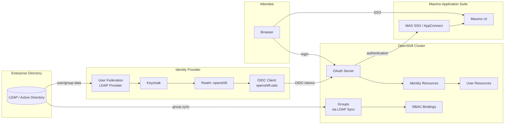

# Identity Topology -- LDAP, Keycloak, OpenShift, and MAS

## Overview

The identity chain connects an enterprise directory (LDAP/AD) through
Keycloak to OpenShift OAuth and IBM Maximo Application Suite SSO. This
enables centralized user management with single sign-on across the
platform.

## Identity flow diagram



## Components

| Component | Role |
|---|---|
| **LDAP / Active Directory** | Authoritative source of user accounts and group memberships |
| **Keycloak** | OIDC identity provider; federates users from LDAP and issues tokens |
| **Keycloak Realm** | Logical grouping of clients, users, and authentication flows |
| **OIDC Client** | Keycloak client configuration for OpenShift OAuth integration |
| **OpenShift OAuth Server** | Authenticates users via configured identity providers |
| **Identity / User resources** | OpenShift objects created when a user authenticates for the first time |
| **LDAP Group Sync** | Periodic job that synchronizes LDAP groups into OpenShift Groups |
| **RBAC Bindings** | ClusterRoleBindings and RoleBindings tied to users or groups |
| **MAS SSO** | Maximo Application Suite identity integration via OpenShift OAuth |

## Authentication flow

1. Attendee navigates to the OpenShift console or Maximo UI.
2. The browser redirects to the OpenShift OAuth server.
3. The OAuth server presents available identity providers (including Keycloak).
4. The attendee selects Keycloak and enters credentials.
5. Keycloak authenticates against its user store (federated from LDAP).
6. Keycloak returns an OIDC token to the OpenShift OAuth server.
7. OpenShift creates or updates Identity and User resources.
8. RBAC bindings determine what the user can access.
9. For MAS: the suite uses OpenShift OAuth for SSO, so the same session
   grants access to the Maximo UI.

## Group synchronization

OpenShift does not dynamically query LDAP groups. Instead, a periodic
`oc adm groups sync` job copies LDAP group memberships into OpenShift
Group objects. RBAC bindings can then reference these groups.

```text
LDAP Group: mas-admins
    |
    v
oc adm groups sync --confirm
    |
    v
OpenShift Group: mas-admins
    members: [user01, user02, ...]
    |
    v
RoleBinding: mas-admins -> admin role in mas-namespace
```

See `identity/ldap-group-sync.yaml` for the sync configuration example.

## Workshop vs production

| Aspect | Workshop | Production |
|---|---|---|
| Keycloak deployment | Single instance, workshop-scoped | HA cluster, externally managed |
| LDAP source | Small demo directory | Enterprise AD / LDAP |
| Group sync | Manual or one-time | Automated CronJob |
| Token lifetime | Default | Tuned per security policy |
| Certificate management | Self-signed or Let's Encrypt | Enterprise PKI |
| Break-glass access | htpasswd backup provider | Documented emergency procedure |
| MFA | Not configured | Required per policy |

See `production-guidance/identity-production.md` for production
recommendations.
