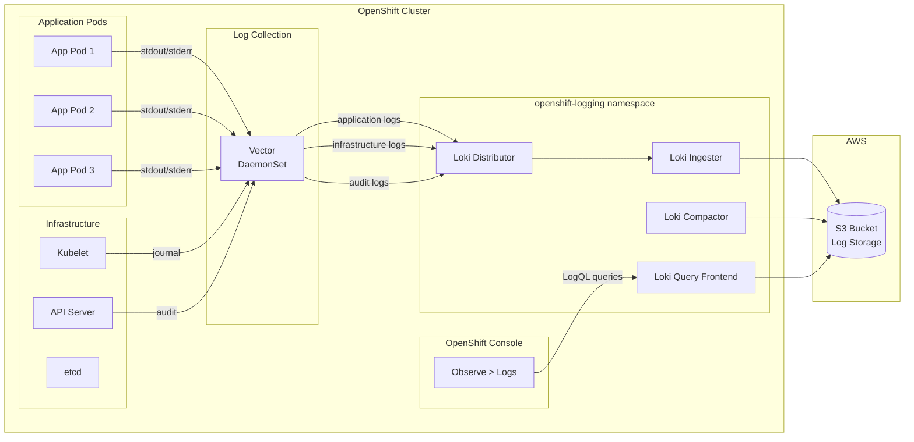

# Logging Topology -- OpenShift Logging with LokiStack

## Overview

OpenShift Logging uses Vector as the log collector and LokiStack as the
log storage and query backend. Logs are persisted to S3-compatible object
storage for durability and historical queries.

## Topology diagram

## Log types

| Type | Source | Description |
|---|---|---|
| **Application** | Container stdout/stderr | Logs from user workloads (namespaces without `openshift-*`, `kube-*` prefixes) |
| **Infrastructure** | System containers, journal | Logs from OpenShift platform components, node journals |
| **Audit** | API server, OAuth server | Kubernetes API audit events, authentication events |

## Component roles

| Component | Role |
|---|---|
| **Vector** (DaemonSet) | Runs on every node. Collects container logs from `/var/log/containers`, journal logs, and audit logs. Forwards to Loki. |
| **Distributor** | Receives log streams from Vector, validates, and routes to ingesters |
| **Ingester** | Buffers log data in memory, compresses, and flushes chunks to S3 |
| **Query Frontend** | Receives LogQL queries, splits them, and distributes to queriers |
| **Compactor** | Merges and deduplicates index and chunk data in S3 |
| **S3 Bucket** | Durable object storage for all log data |

## Data flow summary

1. Application pods write to stdout/stderr.
2. The container runtime writes these to log files on the node.
3. Vector (running as a DaemonSet) reads log files and node journals.
4. Vector enriches logs with Kubernetes metadata (namespace, pod, labels).
5. Vector forwards logs to the Loki distributor, separated by tenant
   (application, infrastructure, audit).
6. The ingester buffers and flushes log chunks to S3.
7. Users query logs via the OpenShift Console (Observe > Logs) using LogQL.
8. The query frontend retrieves matching chunks from S3 and returns results.

## Workshop vs production

| Aspect | Workshop | Production |
|---|---|---|
| LokiStack size | `1x.extra-small` | `1x.medium` or larger |
| Retention | 3 days | 30--90 days (or per policy) |
| S3 replication | Single region | Cross-region replication |
| High availability | No | Yes (multiple replicas) |
| SIEM integration | No | Splunk, CloudWatch, or equivalent |

See `production-guidance/logging-production.md` for production
recommendations.
