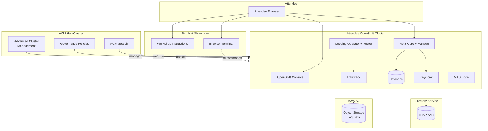

# System Context -- MAS World 2026

## Overview

The MAS World 2026 workshop provides each attendee with a dedicated
OpenShift cluster running IBM Maximo Application Suite. All clusters are
registered with a central Advanced Cluster Management (ACM) hub for fleet
visibility and governance.

## System context diagram

## Components

| Component | Purpose |
|---|---|
| **Showroom** | Delivers workshop instructions, browser terminal, and tab-based access to cluster UIs |
| **OpenShift Console** | Web UI for cluster resource management |
| **MAS Core** | IBM Maximo Application Suite core platform |
| **Maximo Manage** | Enterprise asset management application |
| **Database** | Persistent data store for MAS Manage |
| **Logging Operator** | Deploys Vector collectors for log aggregation |
| **LokiStack** | Log storage and query engine |
| **S3** | Object storage backend for Loki log data |
| **Keycloak** | OIDC identity provider for SSO |
| **LDAP** | Directory service for user and group management |
| **ACM Hub** | Central management plane for fleet governance, policy, and search |
| **MAS Edge** | Visual Inspection Edge (optional, disabled by default) |

## Access flow

1. Attendee opens Showroom in their browser.
2. Showroom provides instructions, a terminal tab, and direct links to the
   OpenShift console and Maximo UI.
3. The browser terminal runs `oc` commands against the attendee's dedicated
   cluster.
4. Each attendee has a unique username, password, and namespace.
5. Attendees cannot access other attendees' clusters or namespaces.
6. The ACM hub is accessed only by the presenter during demonstrations.

## Network boundaries

- Each attendee cluster is independently accessible via its own API and
  ingress endpoints.
- S3 access from each cluster is scoped to that cluster's bucket or prefix.
- The ACM hub communicates with managed clusters over the Kubernetes API.
- Attendees do not have network access to the ACM hub.
