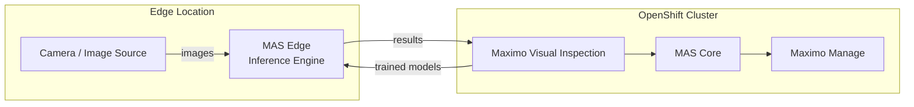

# MAS Edge -- Overview

## What is MAS Edge?

IBM Maximo Visual Inspection Edge (MAS Edge) is a component of IBM Maximo
Application Suite that enables AI-powered visual inspection at the edge.
It allows organizations to deploy trained computer vision models to edge
devices for real-time quality inspection, defect detection, and asset
condition monitoring.

## When to use MAS Edge

- **Quality inspection**: Automated visual quality checks on manufacturing
  lines.
- **Asset monitoring**: Camera-based condition monitoring of physical
  assets.
- **Safety compliance**: Visual verification of safety equipment and
  procedures.
- **Defect detection**: Real-time identification of defects in products or
  infrastructure.

## Architecture

## Resource requirements

MAS Edge is a resource-intensive component. The following are approximate
requirements for a single edge deployment:

| Resource | Minimum | Recommended |
|---|---|---|
| CPU | 4 cores | 8 cores |
| Memory | 8 GB | 16 GB |
| Storage | 50 GB | 100 GB |
| GPU | Optional (CPU inference supported) | NVIDIA GPU for production throughput |

## Workshop status

> **MAS Edge is disabled by default in this workshop.** It is not required
> for the core workshop exercises (logging, ACM, updates, identity). It
> may be enabled on specific clusters for demonstration purposes.

When MAS Edge is enabled on a cluster, attendees can:
- Inspect the MAS Edge deployment and its custom resources.
- View the integration between MAS Edge and Maximo Manage.
- Understand the edge-to-cloud data flow.

Attendees do not need to install, configure, or manage MAS Edge during the
workshop.

## Prerequisites

If enabling MAS Edge:
1. MAS Core must be installed and ready.
2. Maximo Visual Inspection must be configured.
3. Sufficient cluster resources must be available (see table above).
4. Network connectivity between edge and cloud components.
5. Appropriate licensing for the MAS Edge component.

## Further reading

- IBM Documentation: Maximo Visual Inspection Edge
- IBM Documentation: MAS Edge deployment guide
- IBM Documentation: Supported hardware and software for MAS Edge

> **Note**: Consult the current IBM documentation for the exact product
> name, supported versions, and installation procedures, as these may
> change between releases.
